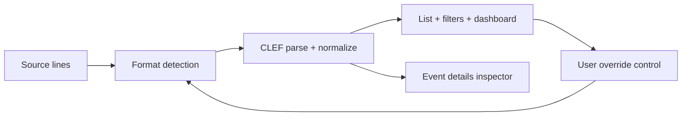

# Requirements

### Overview & Goals
Create a new roadmap sprint immediately after Sprint 13 that defines first-class **Serilog Compact Log Event Format (CLEF)** viewing support, and keep sprint/task numbering consistent across existing docs.

### In Scope
- Add a new sprint document in the existing style (target path pattern: `docs/sprints/sprint-14-*.md`) dedicated to CLEF viewing.
- Add a matching detailed task document in the existing style (target path pattern: `docs/tasks/TASKS-SPRINT-14-*.md`) with hierarchical checkbox IDs.
- Perform and document CLEF research from:
  - `https://clef-json.org/` (schema + tools/resources)
  - `https://datalust.co/docs/posting-raw-events` (newline-delimited JSON ingestion + media type)
  - Relevant tool docs/pages (including `clef-tool`, Compact Log Viewer, Seq, LogViewPlus, and other CLEF-page-listed applications/tools where relevant).
- Include a dedicated sprint section: `## Gap Analysis Against Existing CLEF Tools` with table + narrative classification:
  - Must-have for this sprint
  - Should-have if low risk
  - Deferred
  - Explicit non-goal
- Include an explicit detection-control recommendation (autodetect vs UI switch vs hybrid), with rationale.
- Enforce roadmap insertion rule after Sprint 13 and renumber all later sprints/tasks/references.
- Preserve existing sprint content while renumbering downstream artifacts.

### Out of Scope
- Implementing CLEF runtime parsing/UI code in this task.
- Changing non-roadmap product behavior.
- Rewriting historical sprint scope beyond numbering/reference consistency.

### Mandatory Content Constraints
- User-facing copy must avoid calling the UI state `CLEF mode`; prefer wording like:
  - `Structured event view`
  - `Compact event view`
  - `Event details view`
  - `Serilog compact view`
  - `Structured log view`
- Sprint doc must include all requested sections (goal, background, CLEF summary, scope, UX, detection strategy, architecture notes, data model, parser/filter/dashboard/perf/error plans, testing, risks, dependencies, DoD, acceptance criteria, verification commands, docs updates, rollout/deferred follow-ups).
- Tasks doc must include all requested workstreams (research through closure) and the required test coverage checklist.
- Deliverables section in the authored output must include:
  1. New sprint doc content
  2. New tasks doc content
  3. List of files requiring renumber updates
  4. Old->new sprint renumber map
  5. Assumptions
  6. PO confirmation items

# Technical Design

### Current Implementation (Observed)
- Sprint docs live under `docs/sprints/` (e.g. `sprint-13-power-user-tools.md`, `sprint-14-extensibility-and-release.md`, `sprint-15-network-log-adapters.md`, `sprint-16-open-telemetry.md`).
- Sprint task docs live under `docs/tasks/` (e.g. `TASKS-SPRINT-13-POWER-USER-TOOLS.md`, `TASKS-SPRINT-15-NETWORK-LOG-ADAPTERS.md`, `TASKS-SPRINT-16-OPEN-TELEMETRY.md`).
- Existing structured-data foundation and Serilog compatibility precedent already exists in Sprint 12 artifacts:
  - `docs/sprints/sprint-12-structured-data.md`
  - `docs/tasks/TASKS-SPRINT-12A-STRUCTURED-DATA-FOUNDATION.md`
  - `docs/tasks/TASKS-SPRINT-12D-STRUCTURED-DATA-ECOSYSTEM-COMPATIBILITY.md`
- Codebase already has foundational JSON/structured mechanisms relevant to the new sprint’s architecture notes:
  - Detection/confidence: `core/.../HeuristicProbe.kt`, `JsonConfidenceScorer.kt`
  - Alias normalization: `core/.../CanonicalFieldAliases.kt`, `CanonicalFieldExtractor.kt`
  - Structured model/projection cache: `domain/.../StructuredLogData.kt`, `LogEntry.kt`
  - Details inspector/list rendering state: `ui/.../LogEntryDetails.kt`, `LogList.kt`, `KLogViewerState.kt`, `EntryIntentHandler.kt`
  - Existing Serilog fixture coverage: `core/src/test/.../JsonLogParserTest.kt`, `StructuredEcosystemFixtures.kt`

### Key Decisions
1. **Insert new Sprint 14 for CLEF viewing and shift all downstream sprint numbers by +1**
   - Rationale: preserves roadmap chronology while honoring explicit insertion requirement.
2. **Recommend Hybrid detection/control in sprint design (`autodetect + user override`)**
   - Rationale: aligns with existing heuristic detection architecture while preventing false-positive lock-in.
3. **Use existing structured-data pipeline as the sprint’s implementation baseline in documentation**
   - Rationale: Sprint 12 groundwork already supports typed structured payloads, canonical fields, and inspector workflows.
4. **Treat external tool analysis as capability benchmarking, not parity commitment**
   - Rationale: keeps scope realistic; explicitly label deferred/non-goal capabilities (e.g., full Seq replacement, full `clef-tool` CLI parity).

### Proposed Changes
- Add new sprint spec document (new Sprint 14) with deep CLEF-focused sections and explicit detection recommendation.
- Add new Sprint 14 tasks file with hierarchical IDs and fixture-driven testing requirements.
- Renumber downstream roadmap artifacts and update links/references consistently.
- Include a concrete renumbering map in the produced documentation output.

### File-Level Plan
- **Add**: `docs/sprints/sprint-14-clef-viewing.md`
- **Add**: `docs/tasks/TASKS-SPRINT-14-CLEF-VIEWING.md`
- **Renumber (content preserved, number adjusted)**:
  - `docs/sprints/sprint-14-extensibility-and-release.md` -> Sprint 15 identity
  - `docs/sprints/sprint-15-network-log-adapters.md` -> Sprint 16 identity
  - `docs/sprints/sprint-16-open-telemetry.md` -> Sprint 17 identity
  - `docs/tasks/TASKS-SPRINT-15-NETWORK-LOG-ADAPTERS.md` -> Sprint 16 identity
  - `docs/tasks/TASKS-SPRINT-16-OPEN-TELEMETRY.md` -> Sprint 17 identity
- **Update known cross-references** (at minimum):
  - `README.md`
  - `docs/CONNECTIVITY-DESIGN.md`
  - `docs/tasks/TASKS-SPRINT-8-CONNECTIVITY.md`
  - Any sprint/task links discovered by repo-wide search.

### Architecture Notes to Capture in the New Sprint Doc

### Gap Analysis Methodology (for authored sprint doc)
- Build tool-by-tool rows using the CLEF tools/resources list plus directly relevant viewers.
- For each row: capabilities, KLogViewer current state (has/partial/missing), sprint decision category, and UX patterns to borrow.
- Explicitly separate viewer capabilities from CLI/ingestion ecosystem capabilities.

### Risks & Mitigations
- **Risk**: Numbering drift due inconsistent current naming/headings.
  - **Mitigation**: apply deterministic old->new mapping table first, then update references.
- **Risk**: Overcommitting sprint scope to external tool parity.
  - **Mitigation**: mark must-have vs deferred vs non-goal explicitly.
- **Risk**: UX terminology regression to `CLEF mode`.
  - **Mitigation**: include copy guardrails in both sprint and task docs.

# Testing

### Validation Approach
- Validate documentation completeness against the required section checklist from the issue.
- Validate roadmap integrity by checking all affected sprint/task filenames, headings, and cross-links after renumbering.
- Validate research traceability by ensuring cited CLEF/tool sources are reflected in the gap analysis table and narrative.

### Key Scenarios
- New Sprint 14 doc contains all required sections and explicit detection strategy recommendation.
- New Sprint 14 task file contains hierarchical IDs, required workstreams, acceptance criteria, and verification notes.
- Renumber map is consistent (`14->15`, `15->16`, `16->17` for existing downstream sprints).
- References to renumbered sprint/task artifacts are updated in docs that link to them.

### Edge Cases
- Existing docs with historically inconsistent heading numbers/file names remain content-preserved while numbering is normalized for roadmap order.
- References that use prose (`Sprint 16`) and references that use file paths are both updated.
- Ensure test requirements in the new sprint/task docs explicitly cover CLEF detection false positives, mixed files, malformed lines, live-tail behavior, and structured field filtering/copy flows.

### Verification Commands (to include in authored sprint doc)
- Use focused repository text search for affected sprint/task identifiers before and after renumbering.
- Run markdown/link sanity checks used by the project workflow (if available) and capture results in verification notes.

# Delivery Steps

### ✓ Step 1: Audit roadmap artifacts and lock renumber mapping
A complete inventory of sprint/task docs and cross-references affected by inserting Sprint 14 is produced.

- Enumerate current sprint and task artifacts under `docs/sprints/` and `docs/tasks/`.
- Record baseline numbering inconsistencies (file name vs heading vs prose references).
- Produce canonical downstream renumber mapping (`old -> new`) for all sprints after 13.
- Identify all known dependent references (e.g., `README.md`, connectivity docs, task cross-links).

### ✓ Step 2: Research CLEF spec and external tool capabilities
A source-grounded CLEF capability matrix is prepared for the new sprint’s gap-analysis section.

- Extract current CLEF schema/reified-field and stream semantics from `clef-json.org`.
- Capture newline-delimited ingestion and media-type details from Seq docs (`application/vnd.serilog.clef`).
- Collect relevant capabilities from `clef-tool`, Compact Log Viewer, Seq, LogViewPlus, and CLEF-page-listed tools/resources.
- Classify each capability as must-have, low-risk should-have, deferred, or non-goal for KLogViewer sprint scope.

### ✓ Step 3: Author Sprint 14 CLEF viewing document
A detailed Sprint 14 document is drafted with architecture, UX, detection, performance, and delivery constraints.

- Create `docs/sprints/sprint-14-clef-viewing.md` in the project’s sprint style.
- Include all required sections from goal/background through rollout/deferred follow-ups.
- Add the required `Gap Analysis Against Existing CLEF Tools` table plus detailed narrative.
- Include explicit detection/control decision and rationale (autodetect, switch, or hybrid) with user-facing copy constraints.
- Tie architecture/design notes to existing modules (`:core`, `:domain`, `:ui`) and current parser/inspector/filtering patterns.

### ✓ Step 4: Author Sprint 14 task breakdown document
A detailed, implementation-ready Sprint 14 task document with hierarchical IDs and acceptance checkpoints is produced.

- Create `docs/tasks/TASKS-SPRINT-14-CLEF-VIEWING.md` with stable hierarchical checkbox task IDs.
- Cover all requested workstreams: research, fixtures, detection, parser/normalization, rendering, list/details, filtering, dashboard, override persistence, performance, error handling, tests, docs, closure.
- Add required acceptance criteria and verification notes sections.
- Ensure required fixture-driven test coverage items are explicitly listed, including detection confidence, false positives, mixed/malformed data, live-tail, property-path filtering, grouping, and copy/export flows.

### ✓ Step 5: Apply downstream renumbering and finalize roadmap consistency
All later sprint/task numbering and references are consistent after inserting the new Sprint 14.

- Renumber downstream sprint/task identities and update corresponding filenames/headings while preserving existing content.
- Update cross-document references, indexes, links, and roadmap summaries to the new numbering.
- Produce the required deliverable summary: new docs created, files renumbered, mapping table, assumptions, and PO confirmation items.
- Confirm terminology compliance (no primary user-facing `CLEF mode` wording) across new sprint/task artifacts.