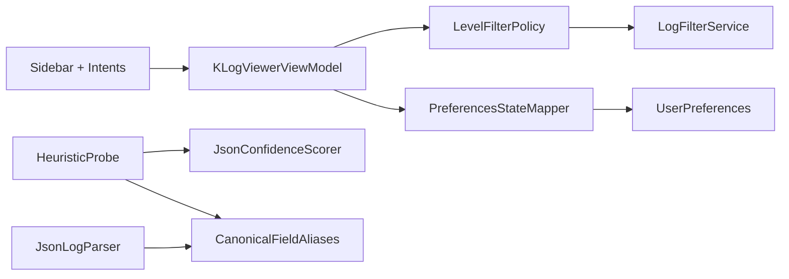

# Requirements

### Overview & Goals
Refactor the recent structured-data changes so they meet the thermo-nuclear maintainability bar while preserving runtime behavior.

### Scope
#### In Scope
- Remove level-filter policy scattering across UI state, intent handling, filtering service, and ViewModel orchestration.
- Restore a typed boundary for level filter selection instead of raw string propagation.
- Centralize canonical alias definitions currently duplicated between JSON parsing and heuristic detection.
- Isolate JSON confidence scoring rules from `HeuristicProbe` into a focused collaborator.
- Keep existing user-visible behavior (toggle semantics, filtering outcomes, parser detection behavior) stable.

#### Out of Scope
- Reworking unrelated dashboard analytics pipelines.
- Rewriting parser templates/logfmt/general parser registry behavior.
- Broad ViewModel decomposition outside the level-filter and parser-confidence concerns.

### Acceptance Criteria
- Level-filter behavior is defined in one canonical policy API and consumed consistently.
- Runtime level-filter data uses a typed key contract (with raw string normalization only at boundaries such as persistence/parser ingestion).
- `HeuristicProbe` and `JsonLogParser` read aliases from one shared canonical source.
- `KLogViewerViewModel` no longer owns feature policy details for level-filter reconciliation.
- Existing regression coverage for filtering and parser detection remains green, with targeted additions for extracted policy paths.

# Technical Design

### Current Implementation
- Level-filter logic is spread across:
  - `ui/src/main/kotlin/com/klogviewer/ui/mvi/KLogViewerState.kt` (`availableLevels`, level ordering)
  - `ui/src/main/kotlin/com/klogviewer/ui/viewmodel/FilterIntentHandler.kt` (toggle/toggle-all semantics)
  - `ui/src/main/kotlin/com/klogviewer/ui/viewmodel/KLogViewerViewModel.kt` (`reconcileLevelFiltersForLogUpdate`, default filter handling)
  - `ui/src/main/kotlin/com/klogviewer/ui/viewmodel/LogFilterService.kt` (entry-level matching)
- Stringly-typed filter keys currently cross state, intents, services, and preferences (`Set<String>` in `LogWindow` and `WindowPreference`).
- Canonical JSON alias sets are duplicated in:
  - `core/src/main/kotlin/com/klogviewer/core/parser/HeuristicProbe.kt`
  - `core/src/main/kotlin/com/klogviewer/core/parser/JsonLogParser.kt`
- Existing extraction pattern in this codebase already favors dedicated policy collaborators (`TimeRangeFilterSupport`, `TabWindowController`, `PreferencesStateMapper`) and should be mirrored.

### Key Decisions
1. Introduce a tiny type for level-filter keys and normalize raw strings only at IO/persistence edges.
2. Extract all level-filter rules into a dedicated `LevelFilterPolicy` collaborator and keep ViewModel as orchestration only.
3. Introduce one canonical alias catalog in `core` consumed by both JSON parsing and heuristic detection.
4. Extract JSON confidence scoring into a focused scorer/policy object to reduce branching density in `HeuristicProbe`.

### Proposed Changes
#### 1) Typed level-filter contract
- Add a small typed contract (e.g. `@JvmInline value class LevelFilterKey`) in `domain`.
- Provide safe factories/normalization helpers for raw values (uppercase/trim, blank rejection/fallback).
- Keep persisted representation backward compatible through mapper conversion.

#### 2) Centralized `LevelFilterPolicy`
- Add `ui/src/main/kotlin/com/klogviewer/ui/viewmodel/LevelFilterPolicy.kt` (or adjacent policy package), owning:
  - available-level derivation + stable ordering
  - single-level toggle
  - toggle-all semantics
  - reconciliation after `LogUpdate`
  - filter predicate/matching helper for `LogEntry`
- Refactor call sites:
  - `KLogViewerState.kt` (remove embedded level ranking policy)
  - `FilterIntentHandler.kt`
  - `KLogViewerViewModel.kt`
  - `LogFilterService.kt`
- Remove duplicated `defaultLevelFilters` constants currently in both handler and ViewModel.

#### 3) Canonical alias source of truth
- Add `core/src/main/kotlin/com/klogviewer/core/parser/CanonicalFieldAliases.kt` containing:
  - canonical key constants
  - alias groups in deterministic precedence order
  - grouped sets for confidence-hit accounting
- Refactor:
  - `JsonLogParser.kt` to consume alias lists/constants from the catalog
  - `HeuristicProbe.kt` to consume same groups for mapping + confidence calculations

#### 4) Confidence policy extraction
- Add collaborator (e.g. `JsonConfidenceScorer` / `JsonDetectionPolicy`) in `core/parser`.
- Move weights, penalties, and score assembly out of `HeuristicProbe` into that collaborator.
- Keep `HeuristicProbe.detect(...)` focused on orchestration (sample -> score -> parser decision).

### File Structure
#### New files
- `domain/src/main/kotlin/com/klogviewer/domain/model/LevelFilterKey.kt`
- `ui/src/main/kotlin/com/klogviewer/ui/viewmodel/LevelFilterPolicy.kt`
- `core/src/main/kotlin/com/klogviewer/core/parser/CanonicalFieldAliases.kt`
- `core/src/main/kotlin/com/klogviewer/core/parser/JsonConfidenceScorer.kt` (name finalization during implementation)
- Targeted test files for new policy/scorer units.

#### Modified files
- `ui/.../KLogViewerState.kt`
- `ui/.../KLogViewerIntent.kt`
- `ui/.../FilterIntentHandler.kt`
- `ui/.../KLogViewerViewModel.kt`
- `ui/.../LogFilterService.kt`
- `ui/.../PreferencesStateMapper.kt`
- `domain/.../UserPreferences.kt` (boundary conversion compatibility if needed)
- `domain/.../LogEntry.kt` (typed resolved key helper)
- `core/.../HeuristicProbe.kt`
- `core/.../JsonLogParser.kt`
- Related tests in `core/src/test/...` and `ui/src/test/...`.

### Architecture Diagram

### Risks & Mitigations
- **Risk:** Persisted legacy filter values may include unknown/blank keys.
  - **Mitigation:** Normalize in mapper boundary; fallback to default typed filter set.
- **Risk:** Changing intent/state type signatures can ripple through Compose/test callsites.
  - **Mitigation:** Perform staged refactor with compile-guided updates and targeted regression tests.
- **Risk:** Alias precedence drift during extraction.
  - **Mitigation:** Lock existing precedence via tests before/after extraction.

# Testing

### Validation Approach
- Preserve behavior by pinning current semantics with focused unit/integration tests before and during extraction.
- Validate both runtime filtering outcomes and parser detection confidence behavior.

### Key Scenarios
- Level toggle, toggle-all, and reconciliation after log updates behave exactly as before for:
  - all-enabled to new-level-set transitions
  - empty selection behavior
  - partial-selection intersection behavior
- `LogFilterService` still filters by resolved level, text queries, source visibility, and time range together.
- `HeuristicProbe` still chooses JSON/template/logfmt/simple in the same representative fixtures.
- Canonical alias precedence remains deterministic for JSON fields (`timestamp`, `level`, `message`, `trace.id`, `span.id`, etc.).

### Test Changes
- Add policy-focused tests for `LevelFilterPolicy` (toggle/toggle-all/reconcile/order/match).
- Update/add UI/ViewModel tests touching level-filter state transitions (notably `DashboardIntentTest` assertions around level filters).
- Add scorer-focused tests for extracted JSON confidence collaborator.
- Keep and update parser regression tests in:
  - `core/src/test/kotlin/com/klogviewer/core/parser/HeuristicProbeTest.kt`
  - `core/src/test/kotlin/com/klogviewer/core/parser/JsonLogParserTest.kt`

# Delivery Steps

### ✓ Step 1: Introduce typed level-filter contract and central policy
Level-filter semantics are implemented once in a dedicated policy with a typed key model.
- Add `LevelFilterKey` tiny type in `domain` with normalization/factory helpers for raw inputs.
- Implement `LevelFilterPolicy` with reusable operations for available-level ordering, single toggle, toggle-all, reconciliation, and matching.
- Add unit tests for policy behavior to lock current semantics before integrating into higher layers.

### ✓ Step 2: Integrate policy across UI state, handlers, and filtering orchestration
UI filtering flow uses `LevelFilterPolicy` end-to-end and removes duplicated ad-hoc logic.
- Refactor `KLogViewerState`, `KLogViewerIntent`, `FilterIntentHandler`, `KLogViewerViewModel`, and `LogFilterService` to consume typed keys/policy methods.
- Remove duplicated `defaultLevelFilters` and `reconcileLevelFiltersForLogUpdate` ownership from ViewModel by delegating to policy.
- Update `PreferencesStateMapper`/`UserPreferences` boundary conversions so persistence remains backward compatible.
- Update affected UI/ViewModel tests (including dashboard-level filter assertions) to validate unchanged behavior.

### ✓ Step 3: Centralize canonical alias definitions for parser and heuristic paths
JSON canonical-field aliases are defined in one shared source and reused consistently.
- Add `CanonicalFieldAliases` in `core/parser` with canonical keys, alias precedence lists, and grouped sets.
- Refactor `JsonLogParser` to read canonical extraction aliases from this catalog.
- Refactor `HeuristicProbe` key-detection mapping to use the same alias catalog.
- Extend parser tests to verify precedence and canonical projection remain stable.

### ✓ Step 4: Extract JSON confidence scoring policy and finish architectural cleanup
`HeuristicProbe` becomes orchestration-focused with scoring policy delegated to a dedicated collaborator.
- Introduce `JsonConfidenceScorer`/`JsonDetectionPolicy` to own weights, penalties, and score composition.
- Replace embedded scoring branches in `HeuristicProbe` with scorer calls while preserving thresholds and decisions.
- Add/adjust confidence-specific tests to validate score stability on canonical vs malformed samples.
- Document the architectural decision in a new ADR and update sprint memory notes to reflect decomposition and rationale.