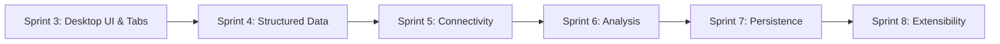

# Requirements

### Overview & Goals
The objective is to define a clear, actionable roadmap that transitions LogViewer from its current "Desktop Transition" state (Sprint 3) to a "complete" professional desktop log analysis product. 

This roadmap addresses the gaps identified in the State-of-the-Art (SOTA) review, including structured data support, remote connectivity, statistical visualization, and extensibility.

### Scope
The roadmap covers Sprints 4 through 8, encompassing the following domains:
- **Structured Data:** First-class support for JSON/XML and tree-view inspection.
- **Connectivity:** Support for SFTP, SSH, Cloud (S3), and direct network appenders.
- **Analysis:** Statistical dashboards, charting, and frequency analysis.
- **Persistence:** Workspace/session saving and advanced querying.
- **Platform:** Plugin architecture, packaging, and high-performance optimizations.

**Out of Scope:**
- Implementation of code or logic.
- Creation of specific tasks in `TASKS.md` (as requested).

# Technical Design

### Current State & Baseline
The project is currently in Sprint 3, which introduces:
- Tabbed interface.
- Chronological interleaving.
- Initial Desktop UI (Menu Bar, Ribbon, Split-Pane).

### Proposed Roadmap Sprints

#### Sprint 4: Structured Data & Advanced Parsing
Focuses on moving beyond plain text logs.
- **Features:** JSON/XML parsing, Tree-view entry inspector, Custom Regex configuration, Column mapping.
- **Key Files:** `docs/sprints/sprint-4-structured-data.md`, `docs/adr/adr-009-structured-data-support.md`.

#### Sprint 5: Connectivity & Remote Sources
Enables log ingestion from distributed environments.
- **Features:** SFTP/SSH tailing, S3/Cloud integration, TCP/UDP Network Appender support.
- **Key Files:** `docs/sprints/sprint-5-connectivity.md`, `docs/adr/adr-010-remote-log-sources.md`.

#### Sprint 6: Analysis & Visualization
Transforms logs into visual insights.
- **Features:** Error rate dashboards, time-series charts, frequency analysis, log diffing.
- **Key Files:** `docs/sprints/sprint-6-analysis-and-visualization.md`, `docs/adr/adr-011-data-visualization-strategy.md`.

#### Sprint 7: Power User Workflows & Persistence
Optimizes the developer experience and context preservation.
- **Features:** Workspace/Session saving (.lvp files), SQL-like Query Builder, context menu expansion.
- **Key Files:** `docs/sprints/sprint-7-power-user-tools.md`, `docs/adr/adr-012-workspace-persistence.md`.

#### Sprint 8: Extensibility & Platform Maturity
Finalizes the product as a stable, extensible platform.
- **Features:** Plugin API, Application packaging (native installers), Auto-updates, >10GB file performance.
- **Key Files:** `docs/sprints/sprint-8-extensibility-and-release.md`, `docs/adr/adr-013-plugin-architecture.md`.

### Architecture Diagrams

#### Roadmap Flow

# Delivery Steps

### ✓ Step 1: Create Architectural Decision Records (ADRs) for future sprints
Create the architectural decision records (ADRs) that will guide the implementation of future sprints.
- Create `docs/adr/adr-009-structured-data-support.md` for JSON/XML and tree-view handling.
- Create `docs/adr/adr-010-remote-log-sources.md` for SFTP, Cloud, and network streams.
- Create `docs/adr/adr-011-data-visualization-strategy.md` for charting and analysis.
- Create `docs/adr/adr-012-workspace-persistence.md` for session saving and project files.
- Create `docs/adr/adr-013-plugin-architecture.md` for extensibility.

### ✓ Step 2: Create Sprint Roadmap Documentation
Create the sprint documentation files for the remaining roadmap to a complete product.
- Create `docs/sprints/sprint-4-structured-data.md`.
- Create `docs/sprints/sprint-5-connectivity.md`.
- Create `docs/sprints/sprint-6-analysis-and-visualization.md`.
- Create `docs/sprints/sprint-7-power-user-tools.md`.
- Create `docs/sprints/sprint-8-extensibility-and-release.md`.