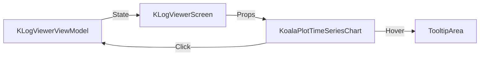

# Requirements

### Overview & Goals
The goal is to fix and improve the dashboard time-series chart to show log event frequency over time. Users should be able to identify spikes and filter logs by clicking on time buckets.

### Scope
- **In Scope**:
    - Fixing the bar chart implementation using `KoalaPlot`.
    - Supporting bucketing by second and minute.
    - Implementing tooltips on hover.
    - Ensuring chronological order of buckets.
    - Supporting click-to-filter behavior.
    - Updating/adding tests for these features.
- **Out of Scope**:
    - Changing the charting library.
    - Adding support for zero-event buckets (as the current data model doesn't support it).
    - Changing level distribution chart behavior.

# Technical Design

### Current Implementation
- The project uses `KoalaPlot` (v0.11.0) for charting.
- `KoalaPlotTimeSeriesChart` currently uses a fixed time format and doesn't support tooltips.
- `InMemoryAnalysisMetricsRepository` handles the bucketing and ensures sorted results.

### Proposed Changes
- **`KoalaPlotTimeSeriesChart` Enhancement**:
    - Add `bucketSize` parameter to drive X-axis formatting.
    - Use `HH:mm:ss` for `PER_SECOND` and `HH:mm` for `PER_MINUTE`.
    - Wrap bars in `TooltipArea` to show bucket details (from, to, count).
    - Use `to - from` for bucket duration instead of calculating it from the first two buckets.
    - Ensure Y-axis only shows integer labels and starts at zero.
- **ViewModel & State**:
    - Leverage existing `SelectDashboardTimeRange` intent for click-to-filter.
    - Ensure `timeSeries` remains sorted (already handled by repository).

### Component Interactions
- `DashboardContent` / `LogTimeFrequencyPanel` → `KoalaPlotTimeSeriesChart` (render)
- `KoalaPlotTimeSeriesChart` → `onBucketSelect` (click event)
- `KLogViewerViewModel` → `applyDashboardTimeRangeSelection` (apply filter)

### Architecture Diagram

### File Structure
- `ui/src/main/kotlin/com/klogviewer/ui/components/KoalaPlotCharts.kt`: Main chart implementation.
- `ui/src/main/kotlin/com/klogviewer/ui/components/KLogViewerScreen.kt`: Call sites for the chart.
- `ui/src/test/kotlin/com/klogviewer/ui/viewmodel/DashboardIntentTest.kt`: Added tests for sorting and filtering.

# Testing

### Validation Approach
- **Manual Verification**:
    - Verify chart rendering with different bucket sizes.
    - Verify tooltips show correct start/end times and counts.
    - Verify clicking a bucket applies the filter and updates the log list.
    - Verify clearing the filter works as expected.
- **Automated Tests**:
    - Add test case in `DashboardIntentTest` for chronological ordering of `timeSeries`.
    - Verify click-to-filter logic via existing tests or new ones if needed.

# Delivery Steps

### ✓ Step 1: Update chart parameters and Y-axis configuration
Update `KoalaPlotTimeSeriesChart` to include `bucketSize` and refine Y-axis.
- Add `bucketSize: DashboardBucketSize` parameter to `KoalaPlotTimeSeriesChart`.
- Update call sites in `KLogViewerScreen.kt` (DashboardContent and LogTimeFrequencyPanel).
- Update `yAxisLabels` to format values as integers.
- Ensure Y-axis range starts at zero and handles small counts gracefully.

### ✓ Step 2: Implement tooltips and X-axis formatting
Implement tooltips and X-axis formatting in `KoalaPlotTimeSeriesChart`.
- Integrate `TooltipArea` (using a custom implementation or `TooltipWrapper`) into the `VerticalBarPlot` bar lambda.
- Display bucket start time, end time, and count in the tooltip.
- Format X-axis labels based on `bucketSize` (HH:mm:ss for seconds, HH:mm for minutes).
- Use actual bucket duration (to - from) for chart calculations.

### * Step 3: Add tests and verify behavior
Verify chronological ordering and selection behavior.
- Add a unit test to `DashboardIntentTest.kt` to verify that `DashboardDataState.Content.timeSeries` is sorted ascending by timestamp.
- Ensure that clicking a bucket correctly applies/toggles the time filter.