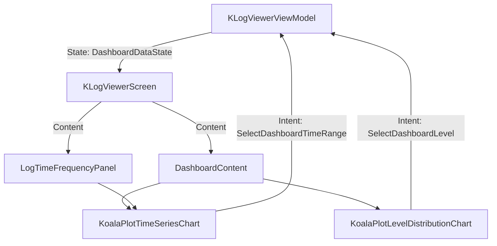

# Requirements

### Overview & Goals
The goal is to replace the current custom-drawn charting logic with **KoalaPlot**, a mature Compose Multiplatform charting library. This will provide a more robust, feature-rich, and performant charting engine that supports advanced interactions like zoom, pan, and better tooltip handling.

### Scope
- **In Scope**:
    - Integration of KoalaPlot library.
    - Migration of the Time Frequency (bar) chart to KoalaPlot.
    - Implementation of a Level Distribution (pie) chart using KoalaPlot.
    - Maintaining all existing interactivity (click-to-filter, hover details).
- **Out of Scope**:
    - Custom chart engine development (forbidden by Sprint 9 restart).
    - Migration of frequency analysis cards (to be addressed later if needed).

### Functional Requirements
- **Time Frequency Chart**:
    - Render log event counts per time bucket as a bar chart.
    - Highlight the selected time bucket.
    - Support clicking a bar to filter logs by that time range.
    - Support hovering to see exact counts and time bounds.
- **Level Distribution Chart**:
    - Render log level ratios as a pie or donut chart.
    - Support clicking a slice to filter logs by that level.
    - Support hovering to see level name and percentage.
- **Consistency**:
    - Use project-defined colors for log levels (ERROR = Red, etc.).
    - Maintain SolarWinds-style layout with the chart at the top of the logs window.

# Technical Design

### Current Implementation
- **Time Series**: Custom `Canvas`-based `DashboardTimeSeriesChart` in `KLogViewerScreen.kt`. It handles its own hit testing via `dashboardBucketIndexForOffset`.
- **Level Distribution**: Simple `Card` list in `DashboardContent`.

### Proposed Changes
- **Dependency**: Add `io.github.koalaplot:koalaplot-core:0.11.0`.
- **Architecture**:
    - Move chart-specific UI components to `ui/src/main/kotlin/com/klogviewer/ui/components/KoalaPlotCharts.kt` to keep `KLogViewerScreen.kt` manageable.
    - Use `XYGraph` with `CategoryAxisModel` for the time-series chart (x-axis = time buckets, y-axis = counts).
    - Use `PieChart` for the level distribution chart.

### Key Decisions
1. **Library Selection**: KoalaPlot (as per ADR-040) for its Compose-native API and performance.
2. **Component Separation**: Moving charts to a dedicated file to improve maintainability of the large `KLogViewerScreen.kt` file.

### Data Models / Contracts
The charts will consume existing `DashboardDataState.Content` fields:
- `timeSeries: List<DashboardTimeBucket>`
- `levelDistribution: List<DashboardLevelSlice>`

### Architecture Diagram

# Testing

### Validation Approach
Verification will focus on ensuring the new charting engine resolves data correctly and maintains the interactivity of the previous custom implementation.

### Key Scenarios
1. **Time Range Selection**: Click a bar in the KoalaPlot chart and verify that the log list filters to that time range.
2. **Level Filtering**: Click a slice in the Pie chart and verify that the log list filters to that level.
3. **Hover Feedback**: Verify that tooltips appear correctly when hovering over bars or pie slices.
4. **Data Updates**: Verify that charts refresh correctly when new logs are loaded or filters are changed.

### Edge Cases
- **Empty Data**: Ensure charts show an appropriate "No data" message.
- **Single Bucket**: Ensure charts render correctly with only one data point.
- **Large Dataset**: Verify performance stays within ADR-039 budgets (first paint < 800ms).

# Delivery Steps

### ✓ Step 1: Add KoalaPlot dependency to the project
KoalaPlot is added to the project's dependency catalog and UI module.

- Add `koalaplot-core = "0.11.0"` to `gradle/libs.versions.toml`.
- Add `implementation(libs.koalaplot.core)` to `ui/build.gradle.kts`.
- Verify project synchronization and build.

### ✓ Step 2: Implement KoalaPlot-based Time Series Chart
A new file `KoalaPlotCharts.kt` is created containing the time-series bar chart implementation.

- Create `ui/src/main/kotlin/com/klogviewer/ui/components/KoalaPlotCharts.kt`.
- Implement `KoalaPlotTimeSeriesChart` using `XYGraph` and `VerticalBarPlot`.
- Map `DashboardTimeBucket` data to KoalaPlot axis models.
- Implement click-to-filter interaction using the `bar` composable slot.
- Implement hover tooltip behavior using KoalaPlot's built-in support or custom overlay.

### ✓ Step 3: Implement KoalaPlot-based Level Distribution Chart
A Pie chart for log level distribution is implemented in `KoalaPlotCharts.kt`.

- Implement `KoalaPlotLevelDistributionChart` using `PieChart`.
- Map `DashboardLevelSlice` data to pie slices.
- Implement click-to-filter interaction on pie slices using `DefaultSlice(clickable = true)`.
- Support hover expansion or tooltips for level details.

### ✓ Step 4: Integrate KoalaPlot charts into the Dashboard and Logs workspace
The Dashboard and Logs workspace are updated to use the new KoalaPlot components.

- Replace `DashboardTimeSeriesChart` calls with `KoalaPlotTimeSeriesChart` in `KLogViewerScreen.kt`.
- Replace or augment the Level Distribution list with `KoalaPlotLevelDistributionChart` in `DashboardContent`.
- Update `LogTimeFrequencyPanel` to use the new KoalaPlot-based chart.
- Ensure visual consistency (colors, sizing) with the existing UI.