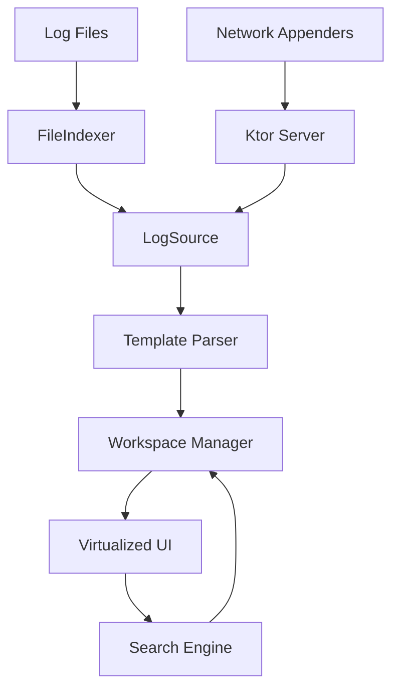

# Requirements

### Overview & Goals
LogViewer is a high-performance desktop application for analyzing large log files and live log streams. It focuses on being "intelligent" by parsing raw text into structured data, allowing for advanced filtering, interleaving, and semantic interaction.

### Scope
- **In Scope:**
    - Support for multi-GB files via indexed virtualization.
    - Template-driven parsing for Serilog, Log4j, and custom formats.
    - Real-time "tail -f" file watching.
    - Interleaved view of multiple logs sorted by timestamp.
    - Background streaming search.
    - HTTP/gRPC server for receiving logs from external appenders.
    - Interactive UI where log values (IPs, IDs) can be clicked to filter.

- **Out of Scope:**
    - Remote file access (SSH/SFTP) in the initial version.
    - Complex log analytics (graphs, charts) - focus is on viewing and searching.
    - Advanced log rotation management (moving files).

### Functional Requirements
- **Virtualized View:** Scroll through millions of lines smoothly without high memory usage.
- **Smart Highlighting:** Automatic color coding for levels (INFO, ERROR, etc.) and detected fields.
- **Interleaving:** A single "Workspace" view that merges multiple log files chronologically.
- **Live Updates:** New logs appearing in files or via network should pop up instantly.
- **Actionable Search:** Search for patterns and jump to results without blocking the UI.

# Technical Design

### Current Context
The project is currently a set of requirement documents. The architecture will be built from scratch using Kotlin and Compose for Desktop.

### Key Decisions
- **Template-First Architecture:** All parsing logic is driven by templates. This ensures consistency between built-in formats (Serilog) and user-defined ones.
- **Indexed Virtualization:** To support massive files, the app will create a lightweight index of file offsets and only parse/store structured objects for the visible portion of the log.
- **Unified Workspace Model:** Multi-log interleaving is achieved by a "Merged Source" that performs a k-way merge of multiple indexed log files.
- **Interactive Semantics:** Log values are treated as interactive tokens rather than just styled text, enabling "Click-to-filter" workflows.
- **Ktor for Integration:** A built-in Ktor server will provide the HTTP/gRPC endpoints for direct log ingestion.

### Proposed Architecture
The application will follow a layered architecture:
1. **Source Layer:** `FileLogSource`, `NetworkLogSource`. Handles raw data retrieval and indexing.
2. **Parsing Layer:** Template engine (Regex/Grok) that turns raw lines into `LogEntry` objects.
3. **State Layer:** `WorkspaceViewModel`. Manages the collection of sources, search state, and filters.
4. **UI Layer:** Compose for Desktop. High-performance virtualized list with rich text rendering.

### Architecture Diagram

### File Structure
- `src/main/kotlin/core/`: Parsing engine, Templates, Indexing logic.
- `src/main/kotlin/data/`: LogSource implementations, File watching.
- `src/main/kotlin/ui/`: Compose components, Virtualized List, Highlighting.
- `src/main/kotlin/server/`: Ktor integration for HTTP/gRPC.

# Testing

### Validation Approach
Verification will focus on performance with large files and the correctness of the interleaving logic.

### Key Scenarios
- **Large File Test:** Open a 1GB log file; scrolling should be smooth (< 100ms frame time), and memory usage should stay below 512MB.
- **Live Tailing:** Manually append lines to a file and verify they appear in the UI within 500ms.
- **Interleaving Test:** Open two files with overlapping timestamps and verify they are correctly interleaved in a single view.
- **Search Test:** Search for a common term in a large file and verify that results start appearing before the full file is scanned.
- **Network Sink:** Use `curl` to send a JSON log entry to the app's endpoint and verify it appears in the active workspace.

# Delivery Steps

###   Step 1: Initialize Project and Core Parsing Engine
Project skeleton with foundational architecture.

- Set up Kotlin Multiplatform (Desktop) project structure.
- Implement the 'Template' domain model for log formats (Regex/Grok based).
- Create the core `LogEntry` and `LogMetadata` data structures.
- Implement the basic `FileIndexer` that scans files for offsets without loading the whole content.

###   Step 2: Implement Virtualized File Reading and Tail-f
Implement the virtualization and tailing logic.

- Implement `VirtualizedLogSource` that reads structured data from file offsets on-demand.
- Add `FileWatcher` using `java.nio.file.WatchService` (or similar) to detect and index appends in real-time.
- Create the basic Compose UI with a `LazyColumn` (or custom virtualized list) to display log entries.

###   Step 3: Develop Intelligent Highlighting and Search
Add color coding and semantic interaction.

- Implement the `Highlighter` engine that applies colors based on the log level and template rules.
- Add 'Interactive Semantic Highlighting': detect clickable entities (IPs, IDs) and implement a simple 'Filter by this' action.
- Add basic Search bar with a background coroutine scanner that populates a results list.

###   Step 4: Implement Multi-log Interleaving and Workspaces
Implement the workspace concept for multi-log analysis.

- Implement the `Workspace` manager that can combine multiple `LogSource`s.
- Create a `MergedLogSource` that uses a k-way merge algorithm to interleave entries by timestamp in real-time.
- Update UI to show the source of each log entry in the interleaved view.

###   Step 5: Integrate HTTP/gRPC Log Sink and Appenders
Add the server-side sink for appenders.

- Integrate Ktor server to listen for HTTP/gRPC log submissions.
- Implement a `NetworkLogSource` that receives these entries and adds them to the active workspace.
- (Draft) Define the JSON/Protobuf contract for the appenders to use.
