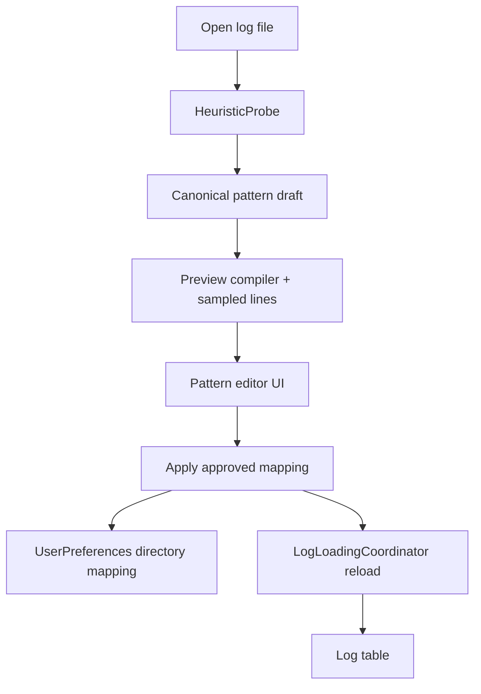

# Requirements

### Overview & Goals
Create a new **UI-first** Sprint 13 focused on editable log-pattern detection and preview when a log is first opened, without regressing the existing structured logging path.

### In Scope
- Show the user the system's best-guess format immediately after opening a log.
- Provide sample lines and a live preview that shows how the current draft pattern maps onto those lines.
- Add a pattern wizard/editor that can also be reopened later from the log UI.
- Persist approved mappings by **directory** in user preferences, stored outside the log directory.
- Support a **canonical internal pattern model** with importers for common pasted formats (initially Logback/Log4J-style and Serilog-style text patterns where feasible).
- Keep structured JSON detection working, including existing `JsonLogParser` / `JsonMapping` behavior.
- Treat Serilog `@mt` placeholders like `{version}` as **preview-visible** in Sprint 13, not as a second parsing pass.
- Produce a detailed Sprint 13 document and a matching tasks document with **HITL review checkpoints at the end of each section**.
- Add a `deferred_decisions.md` artifact for any consciously postponed design or implementation decisions so they can be revisited later.
- Renumber the current `docs/sprints/sprint-13-power-user-tools.md` and subsequent sprint/task documents so the new sprint becomes Sprint 13.

### Out of Scope
- Replacing the existing parser pipeline with a fully draft-driven streaming parser on every keystroke.
- Full semantic extraction of message-template placeholders from structured logs in this sprint.
- Storing mappings inside the log directories.
- Reworking unrelated structured filtering/query-builder behavior.

### Acceptance Criteria
- On first load of an unrecognized or heuristically detected text log, the user sees a best-guess pattern/editor surface before finalizing the mapping.
- Editing the draft pattern updates a preview/mapping view immediately.
- Applying a pattern refreshes the main log table using the existing loading path.
- Approved mappings are reused for later files in the same directory.
- Existing structured JSON logs still auto-detect and render correctly.
- Deferred items are captured in `deferred_decisions.md` with enough context to revisit them later.
- Sprint and task docs are renumbered and the new Sprint 13 is broken into UI-led sections with HITL reviews.

# Technical Design

### Current Implementation
- `core/src/main/kotlin/com/klogviewer/core/parser/HeuristicProbe.kt` selects between `JsonLogParser`, `TemplateLogParser`, `LogfmtParser`, and `SimpleLogParser` from sampled lines.
- `core/src/main/kotlin/com/klogviewer/core/parser/ParserRegistry.kt` registers default `LogTemplate` instances and can return a parser by template name.
- `core/src/main/kotlin/com/klogviewer/core/parser/TemplateLogParser.kt` compiles a `LogTemplate` regex and timestamp pattern into parsed `LogEntry` objects.
- `core/src/main/kotlin/com/klogviewer/core/source/FileLogSource.kt` and `MultilineProcessor.kt` already add multiline behavior when the parser is a `TemplateLogParser`.
- `ui/src/main/kotlin/com/klogviewer/ui/viewmodel/WorkspaceLogLoader.kt` reads sample lines and runs heuristic detection before opening local files.
- `ui/src/main/kotlin/com/klogviewer/ui/viewmodel/LogLoadingCoordinator.kt` updates window parser state and reloads logs through the existing flow.
- `ui/src/main/kotlin/com/klogviewer/ui/components/StatusBar.kt` already exposes parser selection and is the natural launch point for a reopenable wizard.
- `ui/src/main/kotlin/com/klogviewer/ui/mvi/KLogViewerState.kt` / `domain/src/main/kotlin/com/klogviewer/domain/model/UserPreferences.kt` already persist per-window parser state but not directory-scoped pattern mappings.
- `core/src/main/kotlin/com/klogviewer/core/repository/JsonPreferencesRepository.kt` persists settings in the user config area, matching the requested storage location.

### Key Decisions
- Use a **draft overlay** architecture: heuristic detection creates a draft, preview runs on sampled lines, and `Apply` reloads via `LogLoadingCoordinator` instead of mutating the active parser continuously.
- Introduce a **canonical persisted pattern definition** rather than storing raw Logback/Serilog syntax directly.
- Support **importers** from common pasted pattern syntaxes into the canonical model.
- Keep structured JSON parsing authoritative; structured-placeholder support is preview-only in Sprint 13.
- Track any consciously postponed alternatives or nice-to-haves in `deferred_decisions.md`.
- Follow the repo's existing layered split: schema in `:domain`, parser/persistence logic in `:core`, Compose/MVI state in `:ui`.

### Proposed Changes
1. **Pattern definition model**
   - Add a domain-level model for a directory-scoped pattern mapping, likely alongside `UserPreferences` support.
   - Model should distinguish:
     - source directory key
     - canonical field segments / token sequence
     - compiled regex/timestamp metadata
     - optional imported-original pattern text
     - preview-only structured placeholder annotations
2. **Detection + draft creation**
   - Extend `HeuristicProbe` results with enough metadata to prefill the editor instead of only returning parser name/parser instance.
   - Add a draft builder/compiler in `core.parser` that converts canonical definitions into `LogTemplate` and preview rows.
3. **Preview pipeline**
   - Reuse `WorkspaceLogLoader.readSampleLines()` style sampling for live preview input.
   - Add a lightweight preview service that returns line-to-field mapping rows without reloading the whole window on every edit.
   - Only `Apply` should trigger the normal `loadFilesIntoWindow()` refresh.
4. **Directory-scoped persistence**
   - Extend `UserPreferences` with directory mapping preferences stored by normalized directory path / URI.
   - Reuse `JsonPreferencesRepository` so mappings stay in app settings, not beside the logs.
   - Support local, SFTP, and S3 source forms using the same source-ID conventions already present in `WorkspaceLogLoader` and `LogLoadingCoordinator`.
5. **UI flow**
   - Add an initial modal/panel shown after opening a log when a mapping is guessed or missing.
   - Add a reopen action from `StatusBar.kt` (or adjacent active-window controls) for the persistent pattern wizard.
   - Keep the first deliverable visibly UI-led, per your request.
6. **Deferred decision tracking**
   - Create `docs/deferred_decisions.md` (or the repo-agreed equivalent path) as part of the sprint deliverables.
   - For each deferred item, record: title, current choice, why it was deferred, impact/risk, and revisit trigger.
   - Seed it with items already identified in planning, such as full Serilog message-template extraction and any advanced visual-builder follow-ups not included in Sprint 13.

### Components & Files
- `domain/.../UserPreferences.kt` — add directory-scoped mapping persistence shape.
- `core/parser/HeuristicProbe.kt` — return richer best-guess metadata.
- `core/parser/ParserRegistry.kt` / `LogTemplate.kt` / `TemplateLogParser.kt` — compile canonical definitions into runtime parsers.
- `core/parser/JsonLogParser.kt` / `JsonMapping.kt` — preserve existing structured behavior.
- `ui/mvi/KLogViewerState.kt` and `KLogViewerIntent.kt` — hold draft editor state and wizard visibility.
- `ui/viewmodel/LogLoadingCoordinator.kt` / `WorkspaceLogLoader.kt` — wire initial prompt, apply flow, and preference lookup.
- `ui/components/StatusBar.kt` — entry point to reopen the wizard.
- New Compose components near `ui/components/` for pattern preview, field graph/mapping, and editor controls.
- `docs/deferred_decisions.md` — backlog of intentionally postponed decisions.
- Sprint docs: `docs/sprints/` and `docs/tasks/` renumbering plus new Sprint 13/task documents.

### Architecture Diagram

### Risks
- `HeuristicProbe` currently returns parser-centric data; broadening it without tangling runtime and UI concerns needs care.
- Directory identity across local/SFTP/S3 sources can become inconsistent if normalization rules are vague.
- Frequent preview recompilation can feel sluggish if it reparses too many lines; keep previews sample-based.
- Multiline behavior must stay aligned with `TemplateLogParser` + `MultilineProcessor` so preview and final parsing agree.
- Deferred items can get lost unless `deferred_decisions.md` is kept current as part of the sprint workflow.

# Testing

### Validation Approach
- Add unit tests around canonical pattern compilation, importer behavior, and directory-scoped preference persistence.
- Add UI/viewmodel tests for first-open prompt state, live preview updates, apply/reload behavior, and reopenable wizard flow.
- Add regression coverage proving structured JSON detection still routes through `JsonLogParser`.
- Validate that deferred items are explicitly listed in `deferred_decisions.md` when they are excluded from Sprint 13.

### Key Scenarios
- Open a plain text log with a detectable template and verify the draft pattern matches sample lines.
- Edit the draft and verify preview rows/field mappings update without reloading the full window.
- Apply a pattern and verify the window reload uses the approved mapping.
- Reopen another file in the same directory and verify the saved mapping is reused.
- Open a structured JSON log and verify existing columns/structured payload behavior remains intact.
- Verify preview-only Serilog `@mt` placeholder visualization does not change parsed field semantics.
- Verify deferred-but-requested enhancements are captured in `deferred_decisions.md` with revisit notes.

### Test Changes
- Extend `core` parser tests near `HeuristicProbeTest`, `TemplateLogParserTest`, and related parser coverage.
- Extend `ui` tests around `WorkspaceLogLoader`, `LogLoadingCoordinator`, and Compose components for the wizard/editor.
- Include doc-task acceptance items for `./gradlew test`, touched-module checks, and `./gradlew check` in the implementation sprint.

# Delivery Steps

### ✓ Step 1: Define the UI-first Sprint 13 slice and draft interaction flow
Sprint 13 is rewritten around the first-load pattern editor and preview workflow.
- Create the new Sprint 13 document focused on the initial visible UI: best-guess pattern, sample lines, live mapping preview, and reopenable wizard.
- Break the sprint into sections that follow the user journey: first-load prompt, editing experience, apply/reload, persistence, and structured-log compatibility.
- Add a **Human in the Loop** review checkpoint at the end of each sprint section so the UI can be validated incrementally.
- Capture any scope intentionally left out of those sections in `docs/deferred_decisions.md`.

### ✓ Step 2: Design the canonical pattern model, preview compiler, and persistence contract
The sprint design defines one internal pattern representation that can be previewed, compiled, and saved by directory.
- Specify the new domain/persistence shape extending `UserPreferences` for directory-scoped mappings outside the log folder.
- Define how common pasted patterns are imported into the canonical model and compiled back into `LogTemplate` / parser runtime behavior.
- Describe how sampled-line preview differs from final reload through `LogLoadingCoordinator` so live editing stays responsive without breaking existing structured parsing.
- Call out local/SFTP/S3 directory identity rules and preview-only handling for Serilog `@mt` placeholders.
- Record deferred parser/editor variants in `docs/deferred_decisions.md` with revisit triggers.

### ✓ Step 3: Map implementation work onto concrete UI, core, and regression slices
The tasks document turns the sprint into executable implementation slices aligned to existing modules.
- Produce sectioned tasks tied to concrete files in `ui`, `core`, and `domain`, starting with the visible editor UI before deeper parser work.
- Include tasks for `StatusBar` entry points, `KLogViewerState` draft state, `WorkspaceLogLoader` / `LogLoadingCoordinator` apply flow, parser compilation, and preference persistence.
- Add regression tasks protecting `JsonLogParser`, multiline parsing, and existing structured inspector behavior.
- End every section with a HITL review task as requested.
- Add documentation tasks to keep `docs/deferred_decisions.md` updated when decisions are postponed.

### ✓ Step 4: Renumber affected sprint and task documentation
The documentation plan leaves the sprint sequence consistent after inserting the new Sprint 13.
- Renumber the current `docs/sprints/sprint-13-power-user-tools.md` and all later sprint files to shift them forward.
- Renumber the matching `docs/tasks/TASKS-SPRINT-13-...` and later task files, preserving references/dependencies.
- Include `docs/deferred_decisions.md` in the documentation set for this sprint so renumbered follow-on sprints can reference it.
- Note any follow-up architecture/document-memory updates that the implementation sprint should perform when the work is actually completed.

### ✓ Step 5: Define canonical pattern draft model and MVI state/intents (Tasks 13.5.1, 13.5.14)
Define domain data classes for pattern tokens/pills, token roles (`Timestamp`, `Level`, `Thread`, `Logger`, `Message`, `Custom Property`), delimiters, and pattern draft state with undo/redo stack.
- Create canonical pattern draft model types in `:domain` or `:ui`.
- Add pattern wizard draft state to `KLogViewerState.kt` / `LogWindow`.
- Add pattern wizard intents in `KLogViewerIntent.kt` for wizard actions (toggle visibility, update draft, add/remove/reorder tokens, reconfigure token, undo/redo, apply draft, skip/cancel).
- Implement unit tests for draft state mutation and undo/redo logic.

### ✓ Step 6: Build Pattern Wizard sub-components (Tasks 13.5.3 - 13.5.9, 13.5.13, 13.5.16)
Implement individual Compose components in `ui/src/main/kotlin/com/klogviewer/ui/components/pattern/`.
- `PatternImporterBar.kt` (13.5.3)
- `PatternTokenBar.kt` (13.5.4)
- `PatternTokenConfigPopover.kt` (13.5.5)
- `SampleLineInspector.kt` (13.5.6)
- `SampleLineSelectionPopup.kt` (13.5.7)
- `PatternTablePreview.kt` (13.5.8)
- `PatternMatchSummary.kt` (13.5.9)
- Bidirectional hover synchronization (13.5.13)
- `@Preview` composables for each component (13.5.16)

### ✓ Step 7: Build PatternWizardDialog container, banner mode, ergonomics & keyboard navigation (Tasks 13.5.2, 13.5.12, 13.5.14, 13.5.15)
Integrate all 5 zones into `PatternWizardDialog.kt`.
- Resizable modal container with Zone 3/4 draggable splitter and remembered window size (13.5.2, 13.5.15).
- High-confidence confirmation banner variant (`Apply / Review / Skip`) and `Skip — open as plain text` escape hatch (13.5.12).
- Keyboard shortcuts (`Esc`, `Cmd/Ctrl+Enter`, arrow-key pill navigation, `Delete`, `Cmd/Ctrl+Z`) (13.5.14).

### ✓ Step 8: Wire first-load prompt & status bar reopen integration (Tasks 13.5.10, 13.5.11)
Connect heuristic detection and UI state in `WorkspaceLogLoader` / `LogLoadingCoordinator` and `StatusBar`.
- Trigger pattern wizard prompt when heuristically detected text logs are opened (13.5.10).
- Add reopen button in `StatusBar.kt` (13.5.10).
- Ensure cancel/close/skip actions are non-destructive to active parser state (13.5.11).

### ✓ Step 9: Testing, verification, task checkbox updates, and HITL summary (Task 13.5.17)
Run tests and check `./gradlew check`, verify UI with `./gradlew :app:run`, update task checkboxes in `docs/tasks/TASKS-SPRINT-13-PATTERN-WIZARD.md`, and summarize deliverables for HITL review.

### ✓ Step 10: Implement PatternPreviewService and Draft Compilation (Tasks 13.6.1, 13.6.5)
Introduce an injectable `PatternPreviewService` in `:core` / `:ui` and draft-to-`LogTemplate`/`TemplateLogParser` compiler to generate sample spans, preview table rows, and errors from a draft pattern.

### ✓ Step 11: Debounced preview recompute & UI integration in MVI and components (Task 13.6.2)
Wire draft mutations to schedule debounced (~150 ms) off-UI-thread preview calculations with stale-result discard, updating the state-driven preview in `PatternWizardDialog`.

### ✓ Step 12: Resample control & sample line formatting (Task 13.6.3)
Add head/middle/tail line sampling with multiline aggregation and soft-wrap expand toggles to `SampleLineInspector`.

### ✓ Step 13: Apply & Load flow in LogLoadingCoordinator (Task 13.6.4)
Wire `ApplyPatternDraft` in `LogLoadingCoordinator` to compile the approved draft and reload the log window through the existing pipeline.

### ✓ Step 14: Testing, verification, task checkbox updates, and HITL review (Tasks 13.6.5, 13.6.6)
Add unit/integration tests for preview, alignment, debounce, resample, apply; run `./gradlew check`, verify with `./gradlew :app:run`, update task checkboxes, and provide HITL summary.