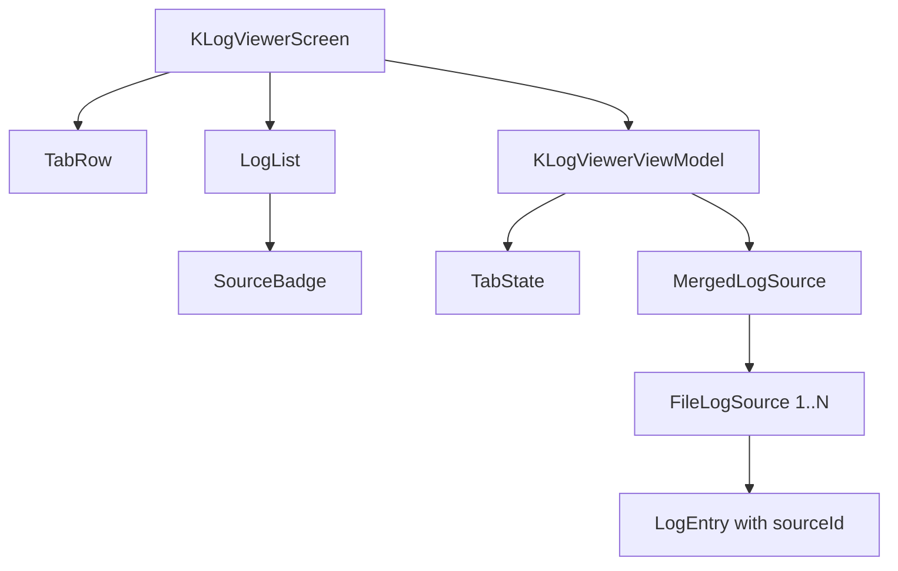

# Requirements

### Overview & Goals
The third sprint introduces multi-log support, allowing users to analyze multiple log files simultaneously. We will implement two primary viewing modes: **Tabs** for isolated file viewing and **Interleaving** for a unified chronological stream of multiple files. This enhances the tool's utility for correlating events across different services or application components.

### Scope
**In Scope:**
- **Tabbed Interface**: Switch between multiple open log views.
- **Interleaved View**: Merge multiple selected log files into a single, time-ordered list.
- **Source Identification**: Visual colored badges to identify the origin of log entries in interleaved views.
- **Multi-File Selection**: Support for selecting multiple files in the file picker (creating an interleaved tab).
- **Workspace Management**: Adding/Removing files from the current view.
- **Documentation**: Formal sprint document and ADRs for architectural changes.

**Out of Scope:**
- Persistent workspaces (saved to disk).
- Different parsing templates per file in the same interleaved view (will use the default parser for all).

# Technical Design

### Current Implementation
The application currently supports viewing a single log file at a time. The `KLogViewerState` holds a single list of logs, and the `KLogViewerViewModel` manages a single loading job.

### Key Decisions
- **Workspace-Centric State**: `KLogViewerState` will be refactored to hold a list of `TabState` objects, each representing a Tab.
- **LogEntry Attribution**: `LogEntry` will be updated to include an optional `sourceId` (filename) to track its origin.
- **Chronological Merging**: A chronological merge algorithm based on `LogTimestamp` will be used to interleave entries.
- **Dynamic Coloring**: Sources in an interleaved view will be assigned colors from a predefined palette.
- **Documentation First**: All architectural decisions and sprint goals will be documented in `docs/` before implementation.

### Proposed Documents
1.  **`docs/sprints/sprint-3-log.md`**: Detailed sprint plan.
2.  **`docs/adr/adr-006-multi-log-interleaving.md`**: Design for merging multiple log streams.
3.  **`docs/adr/adr-007-tabbed-interface-architecture.md`**: Design for the tabbed MVI state.

### Proposed Changes
- **Domain (`domain/model`)**:
    - Update `LogEntry` to include `sourceId: String?`.
- **Core (`core/source`)**:
    - `MergedLogSource`: A new source that combines multiple `observeLogs` streams and merges them chronologically.
- **MVI (`ui/mvi`)**:
    - Refactor `KLogViewerState` to support `tabs: List<TabState>` and `activeTabId`.
    - Add `KLogViewerIntent.AddTab`, `KLogViewerIntent.CloseTab`, `KLogViewerIntent.SwitchTab`.
- **Components (`ui/components`)**:
    - `TabRow.kt`: Header component for tab navigation.
    - `SourceBadge.kt`: Visual label for log entries.
    - Update `LogList.kt` and `LogEntryRow.kt` to handle multiple sources.

### Architecture Diagram

# Testing

### Validation Approach
- **Multi-File Verification**: Load two files with overlapping timestamps and verify they are correctly interleaved.
- **Tab Persistence**: Switch between tabs and ensure the scroll position and filters are maintained (in-memory).
- **Source Visibility**: Verify that badges are hidden when viewing a single file but visible in interleaved mode.

### Key Scenarios
- **Scenario: Interleaving Two Files**: User selects `app.log` and `db.log`. The resulting view shows entries from both, sorted by time, with distinct source badges.
- **Scenario: Tab Switching**: User opens `file1.log`, then opens `file2.log` in a new tab. Switching back to the first tab preserves the search query and scroll position.

# Delivery Steps

### ✓ Step 1: Initialize Sprint 3 Documentation
Establish the formal plan and architectural foundation.

- Create `docs/sprints/sprint-3-log.md` with goals and scope.
- Create `docs/adr/adr-006-multi-log-interleaving.md` for merging strategy.
- Create `docs/adr/adr-007-tabbed-interface-architecture.md` for tabbed state.

### * Step 2: Implement Tabbed Infrastructure
Refactor state management and UI to support multiple concurrent views.

- Define `TabState` to encapsulate tab-specific data (logs, filters).
- Update `KLogViewerState` with `tabs` list and `activeTabId`.
- Create `TabRow` component for navigating between tabs.
- Implement `AddTab`, `CloseTab`, and `SwitchTab` intents.

###   Step 3: Implement Multi-File Loading and Interleaving
Add support for merging multiple log streams.

- Update `LogEntry` to include `sourceId`.
- Implement `MergedLogSource` in `:core` for chronological merging.
- Update `KLogViewerViewModel` to handle multi-file selection and interleaved loading.
- Ensure search and filtering are applied to the merged stream.

###   Step 4: Source Identification and UI Polish
Visualize the origin of logs and refine the user experience.

- Implement `SourceBadge` component for log origin visualization.
- Update `LogEntryRow` to display badges in interleaved tabs.
- Assign dynamic colors to log sources for visual distinction.
- Add "Add File to Workspace" capability to the Sidebar.