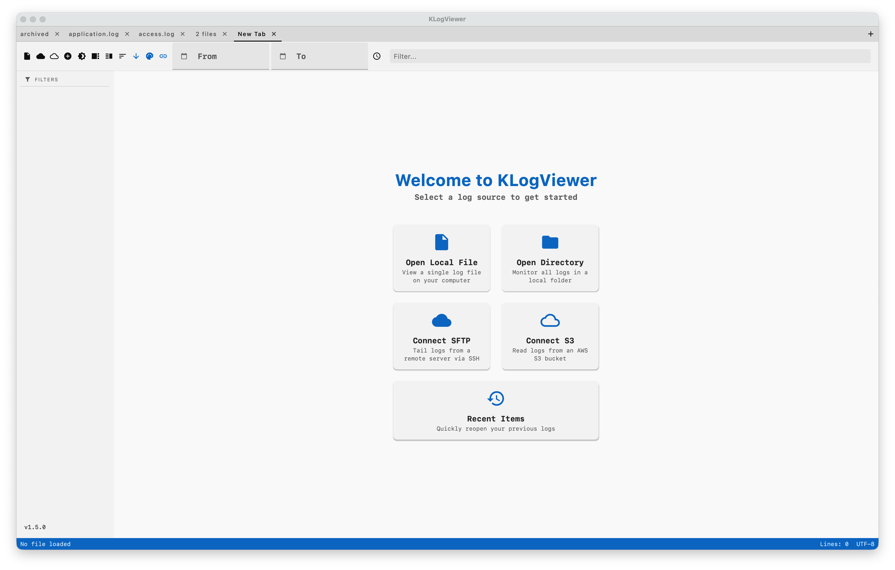
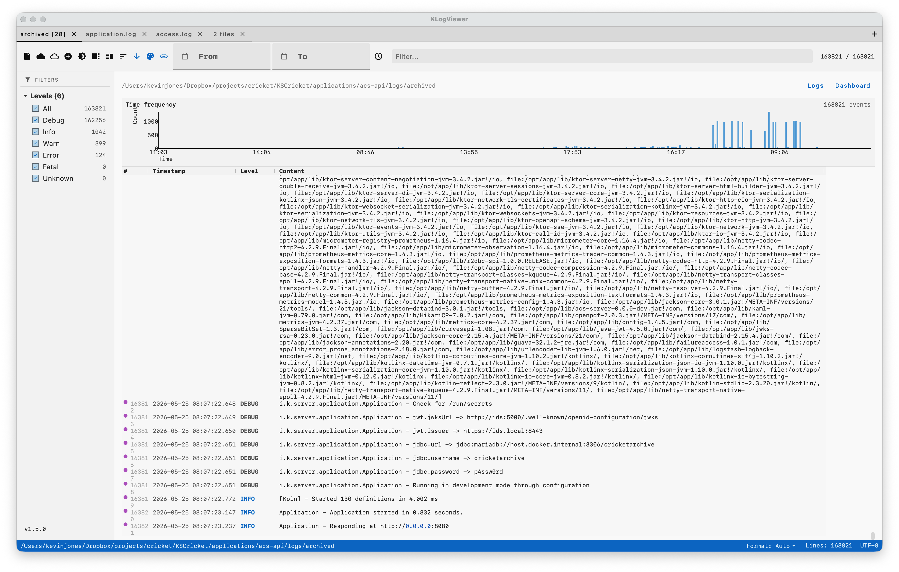
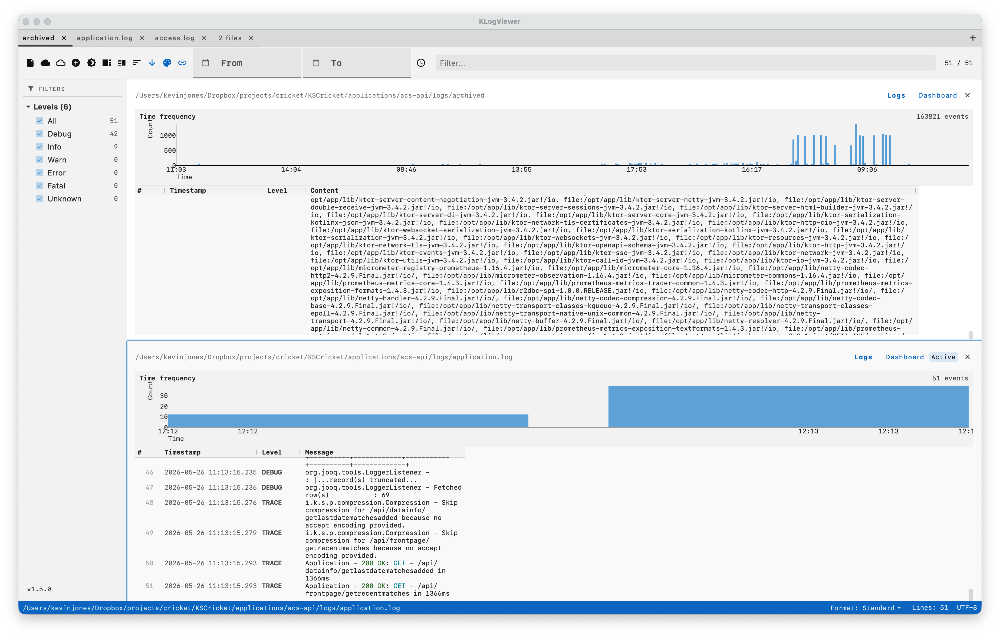
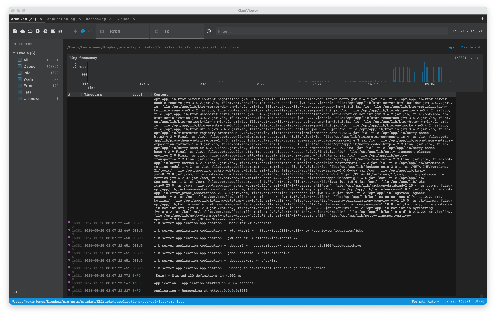

# KLogViewer

[](https://github.com/kevinrjones/klogviewer/actions)
[](https://kotlinlang.org)
[](https://www.jetbrains.com/lp/compose-multiplatform/)
[](LICENSE)


KLogViewer is a professional-grade, high-density desktop log viewer built with Kotlin and Compose for Desktop. It is designed to handle large log files and complex distributed system events with ease, providing a reactive and highly customizable viewing experience.

## Release Notes

For details on the latest customer-facing release, see [RELEASE_NOTES.md](RELEASE_NOTES.md).

For the complete release history, see [ALL_RELEASES.md](ALL_RELEASES.md).

## Key Features

### Multiple Tabs & Workspaces
Work on multiple log files or different views simultaneously using a native tabbed interface. Each tab maintains its own filters, search queries, and scroll position.

### Horizontal Split Panes
Inspect log entries in detail without losing context. Selecting a log entry opens a horizontal detail pane at the bottom, displaying full content, stack traces, and structured metadata.

### Interleaved Log Streams
Merge multiple log files into a single, chronologically sorted view. Visual source badges and subtle background shading help you distinguish between different log sources at a glance.

### Real-time Log Tailing
Monitor your logs as they grow. KLogViewer uses an efficient polling mechanism to detect file appends and automatically scrolls to the latest entries.

### Remote Log Streams (SFTP)
Connect to remote servers and tail logs in real-time over SSH. Supports both password and public-key authentication (RSA, Ed25519, etc.) with optional passphrase support for encrypted keys.

### AWS S3 Log Sources
Read log objects directly from AWS S3 using default credential chain, named profiles, or explicit credentials. Monitor a single object key or a whole prefix (directory-style) and follow new log data as it arrives.

### Secure Credential Storage
Saved remote credentials are protected with native OS secret stores (macOS Keychain, Linux Secret Service via `secret-tool`, and Windows Credential Locker via PowerShell `PasswordVault`) when available.

### Advanced Heuristic Parsing
Supports a wide variety of log formats out-of-the-box, including:
- **Standard Text**: ISO8601, Apache, Syslog, CSV.
- **Structured Data**: JSON and Logfmt (key-value) formats.
- **Multiline Support**: Automatically aggregates stack traces and indented content.
- **Auto-Detection**: Heuristically probes file content to select the best parser template.

### Professional Grid UI
- **Resizable Columns**: Interactively adjust column widths with persistence across sessions.
- **Command-Line Chic Theme**: Custom Industrial Dark and Clean Light palettes.
- **Regex Filtering & Search**: Real-time filtering with support for complex regular expressions.
- **Smart Highlighting**: Automatically highlights IDs, IP addresses, and timestamps.

## Screenshots

### Welcome Screen

*The welcome screen with a simple file picker to select a log file to open.*

### Main Interface

*The high-density grid showing interleaved logs with source badges and level filtering.*

### Split View & Details

*The horizontal detail pane displaying a full stack trace for a selected ERROR entry.*

### Dark Mode

*Industrial Dark theme designed for long-running analysis sessions.*

## Technology Stack

- **Language**: Kotlin 2.0.0
- **UI Framework**: Compose for Desktop (JetBrains)
- **Architecture**: MVI (Model-View-Intent) for predictable state management
- **Logic**: Arrow for functional error handling and data flow
- **Testing**: JUnit 5, Strikt (assertions), and Cucumber JVM (BDD)
- **Build System**: Gradle Kotlin DSL with Version Catalog

## Getting Started

### Prerequisites
- JDK 17 or higher

### Running the Application
To run the application directly from source:
```bash
./gradlew :app:run
```

### Building the Native Distribution
To create a native distribution for your operating system (DMG, MSI, or DEB):
```bash
./gradlew :app:package
```
Distributions will be available in `app/build/compose/binaries`.

### Static Analysis (Detekt)

Run static analysis locally:

```bash
./gradlew detekt
```

Detekt is wired into module `check` tasks, so `./gradlew check` also executes static analysis.

Detailed policy and governance (suppression hygiene, baseline updates, burn-down ownership):

- `docs/DETEKT.md`

## Usage

### Sprint 8 Connectivity Overview
Sprint 8 introduced end-to-end remote connectivity in KLogViewer:

- **SFTP/SSH tailing** for remote host log files.
- **AWS S3 ingestion** for object and prefix-based log sources.
- **Secure saved connections** with OS-level credential storage.

### Sprint 16 Network Adapter Plan
TCP/UDP network listeners are tracked as a dedicated Sprint 16 scope. See:

- `docs/sprints/sprint-16-network-log-adapters.md`
- `docs/tasks/TASKS-SPRINT-15-NETWORK-LOG-ADAPTERS.md`
- `docs/CONNECTIVITY-DESIGN.md`

### Connecting to SFTP Log Sources
KLogViewer allows you to tail logs from remote servers via SFTP.

1. Go to **File > Connect to SFTP...**
2. Enter the **Host**, **Port** (default 22), and **Username**.
3. Choose your **Authentication** method:
   - **Password**: Enter your SFTP password.
   - **Key Pair**: 
     - Click **Browse** to select your **Private Key file**. You should select your **private** key (e.g., `id_rsa`, `id_ed25519`), not the public `.pub` file.
     - If your private key is protected by a password, enter it in the **Passphrase (Optional)** field.
4. Enter the **Log File Path** on the remote server (e.g., `/var/log/syslog`).
5. Click **Connect**.

How it works:
- KLogViewer authenticates with SSH using your selected method.
- It tails the remote file using `tail -f` semantics and streams appended lines into the parser pipeline.
- Parsed entries are emitted as initial load + incremental appends for real-time updates.

### Connecting to AWS S3 Log Sources
KLogViewer supports S3 log reading from the **Connect to S3** action in the UI.

1. Open the **Connect to S3** dialog.
2. Enter a **Connection Name**, **Bucket Name**, and optional **Region** (default commonly `us-east-1`).
3. Choose an authentication mode:
   - **Default (Env/Web Identity)**: Uses AWS SDK default credential chain.
   - **AWS Profile**: Uses a named local AWS profile.
   - **Explicit Credentials**: Uses Access Key ID + Secret Access Key.
4. Enter an **S3 Prefix / Object Key**.
   - Use an object key to follow one log object.
   - Use a prefix to browse/monitor directory-style S3 log layouts.
5. Click **Connect** (or **Browse** first to inspect available objects).

How it works:
- For single objects, KLogViewer polls S3 and uses object size + byte-range requests to fetch only appended content.
- For prefixes/directories, KLogViewer periodically rescans and attaches observers to discovered objects.

### How Secure Storage Works
When you save SFTP/S3 connections, KLogViewer protects secrets before writing preferences:

- SFTP password auth: stores password in OS keychain and persists a marker in JSON.
- SFTP key auth: stores private-key passphrase in OS keychain (if provided) and persists a marker.
- S3 explicit auth: stores secret access key in OS keychain and persists a marker.

On load, markers are resolved back into live credentials from the OS keychain.

Platform behavior:
- **macOS**: Uses the `security` CLI.
- **Linux**: Uses `secret-tool` (Secret Service API).
- **Windows**: Uses PowerShell with `Windows.Security.Credentials.PasswordVault`.

If secure storage is unavailable on the host, KLogViewer asks for explicit confirmation before saving the secret in plaintext. If you decline, the connection settings are not persisted.

### Continuous Integration & Deployment
KLogViewer uses GitHub Actions for automated building and packaging. For every push to the `main` branch, the following are automatically generated:
- **Installers**: DMG (macOS), MSI (Windows), and DEB (Linux).
- **Standalone Executables**: Platform-specific zipped bundles for all three major operating systems.
- **Static Analysis Gate**: Detekt runs before tests and fails the workflow on violations; failed runs publish Detekt artifacts for debugging.

You can find these deployable units in the [GitHub Actions artifacts](https://github.com/kevinrjones/klogviewer/actions).

## Architecture

KLogViewer follows a clean, multi-module architecture:
- `:domain`: Core business models and interfaces.
- `:core`: Business logic, parsers, and repository implementations.
- `:ui`: Composable components, themes, and MVI state management.
- `:app`: Application entry point and configuration.

## License

This project is licensed under the MIT License - see the [LICENSE](LICENSE) file for details.
