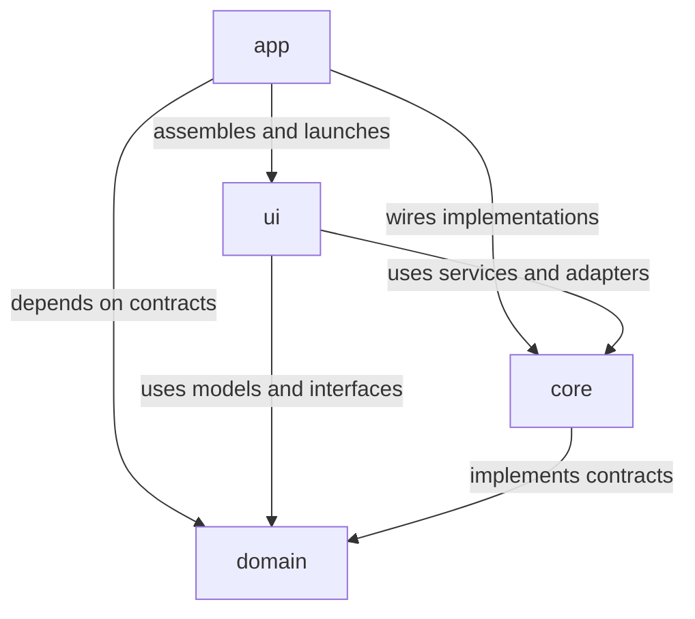
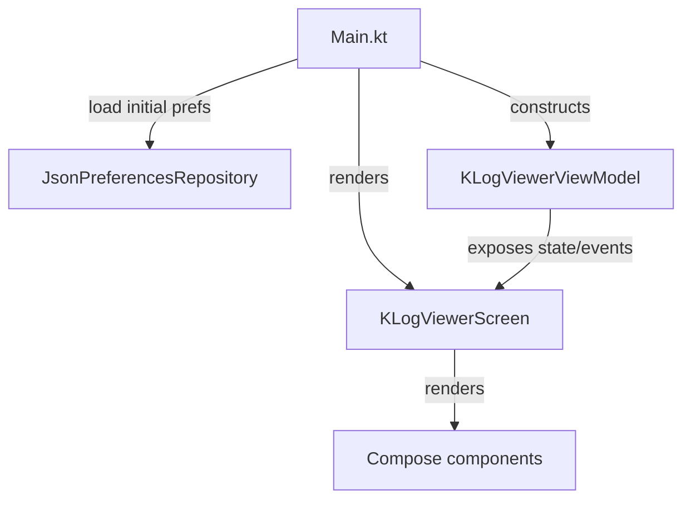
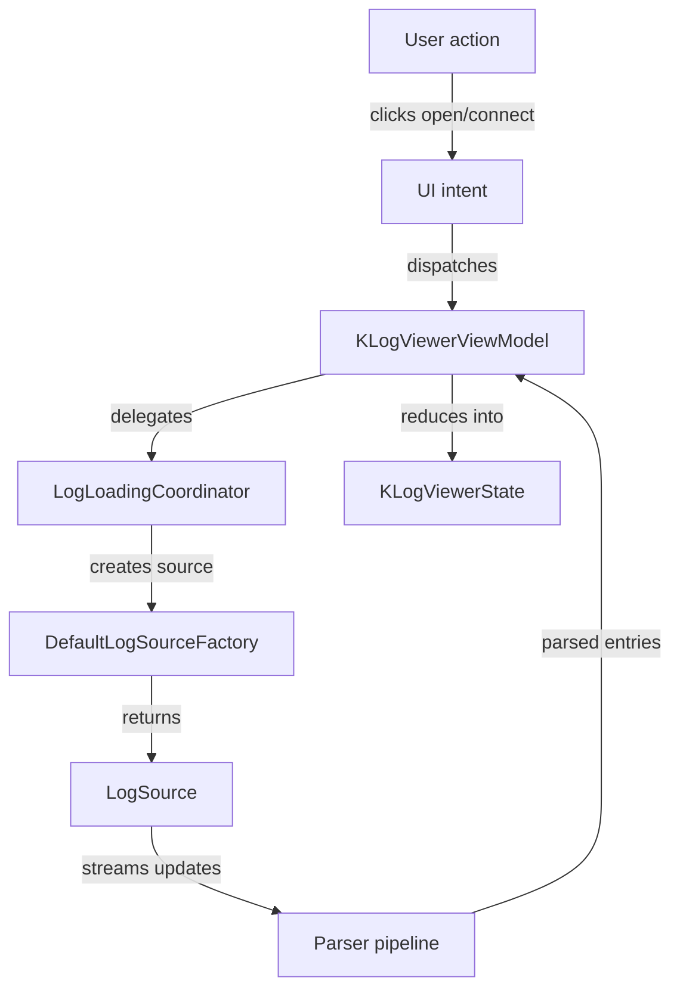
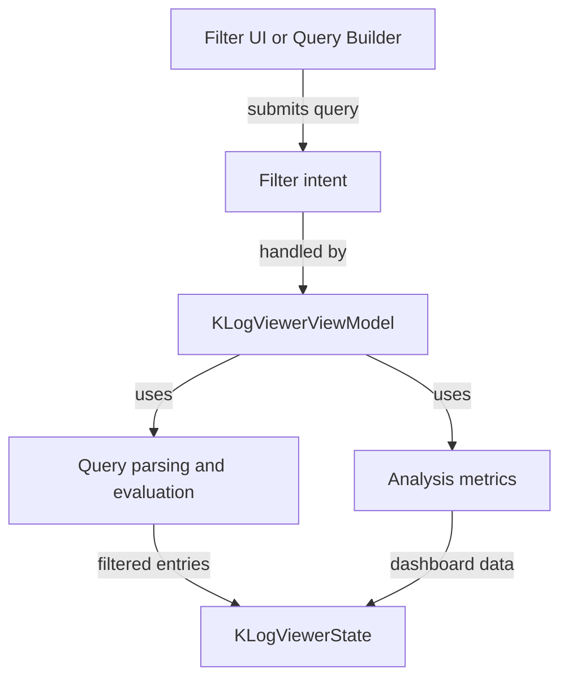

# KLogViewer Architecture Guide

This document is the architecture map for KLogViewer.
It is intended for both human contributors and agents that need a fast, reliable overview of the codebase before making changes.

## Purpose

- Explain the system module by module.
- Explain the major areas inside each module.
- Show the main runtime flow from UI action to log ingestion, filtering, analysis, and persistence.
- Give future contributors a checklist for when this document must be updated.

## System at a Glance

KLogViewer is a Kotlin/Compose Desktop application for opening, tailing, filtering, inspecting, and analyzing local and remote log sources.
The repository is organized as a four-module Gradle build with a deliberately one-way dependency flow.

## Top-Level Module Responsibilities

| Module | Role | Depends On | Key Responsibilities |
| --- | --- | --- | --- |
| `:domain` | Stable contract and model layer | None | Domain models, tiny types, parser/source/repository interfaces, preference schema, failure types |
| `:core` | Implementation and infrastructure layer | `:domain` | Log parsers, log-source implementations, remote adapters, preferences persistence, secure credential handling, analysis services |
| `:ui` | Desktop UI and application state layer | `:domain`, `:core` | Compose screens/components, MVI state/events/intents, filtering/query logic, workspace orchestration, dashboard interactions |
| `:app` | Composition root and packaging layer | `:domain`, `:core`, `:ui` | Desktop entry point, menu wiring, concrete dependency assembly, native distribution packaging |

## Module-by-Module Detail

### `:domain` - contracts, data shapes, and invariants

Representative files:

- `domain/src/main/kotlin/com/klogviewer/domain/model/LogEntry.kt`
- `domain/src/main/kotlin/com/klogviewer/domain/model/StructuredLogData.kt`
- `domain/src/main/kotlin/com/klogviewer/domain/model/UserPreferences.kt`
- `domain/src/main/kotlin/com/klogviewer/domain/repository/LogSource.kt`
- `domain/src/main/kotlin/com/klogviewer/domain/repository/PreferencesRepository.kt`

Primary areas:

1. **Log and analysis models**
   - Defines the shared data structures used across the entire application.
   - Includes log entries, structured payload representations, dashboard analysis types, and failure models.

2. **Persistence contracts**
   - Defines the application preference/workspace shape through `UserPreferences`, `TabPreference`, and `WindowPreference`.
   - Establishes what higher layers can save and restore without committing to a concrete storage mechanism.

3. **IO boundaries**
   - Defines interfaces such as `LogSource`, `LogSourceFactory`, `PreferencesRepository`, `LocalFileSystem`, `RemoteFileSystem`, `Clipboard`, and `LogAnalysisService`.
   - These contracts allow the UI to depend on capabilities instead of implementation details.

4. **Type-safety layer**
   - Holds tiny types and sealed failure hierarchies used to keep parsing, loading, and filtering logic explicit.

Why it matters:

- `:domain` is the shared language of the application.
- If a concept appears in more than one module, it should usually be modeled here first.

### `:core` - parsers, sources, persistence, and infrastructure adapters

Representative files:

- `core/src/main/kotlin/com/klogviewer/core/parser/ParserRegistry.kt`
- `core/src/main/kotlin/com/klogviewer/core/parser/JsonLogParser.kt`
- `core/src/main/kotlin/com/klogviewer/core/source/DefaultLogSourceFactory.kt`
- `core/src/main/kotlin/com/klogviewer/core/source/SftpLogSource.kt`
- `core/src/main/kotlin/com/klogviewer/core/source/S3LogSource.kt`
- `core/src/main/kotlin/com/klogviewer/core/repository/JsonPreferencesRepository.kt`

Primary areas:

1. **Parsing pipeline (`core.parser`)**
   - Parses plain text, template-driven logs, multiline logs, `logfmt`, and JSON/structured logs.
   - Maintains canonical field aliasing, typed structured-value mapping, heuristic probing, and timestamp/level extraction.

2. **Log source implementations (`core.source`)**
   - Converts local files, local directories, SFTP files/directories, and S3 objects/prefixes into streaming `LogSource` implementations.
   - `DefaultLogSourceFactory` chooses the correct runtime implementation for each source kind.
   - `MergedLogSource` and related coordinators support multi-source viewing.

3. **Remote connectivity adapters**
   - `SshService`, `SshClientPool`, `SftpFileSystem`, `S3ClientProvider`, `S3FileSystem`, and `UnifiedRemoteFileSystem` isolate transport-specific behavior.
   - This keeps the UI layer unaware of SSH/S3 SDK details.

4. **Persistence and credentials (`core.repository`)**
   - `JsonPreferencesRepository` persists `UserPreferences` as JSON.
   - `CredentialProtectionService` and `SecureCredentialStore` protect secrets using OS keychain mechanisms when available.
   - `JavaLocalFileSystem` and `AwtClipboard` provide desktop-specific adapters for domain interfaces.

5. **Analysis services (`core.analysis`)**
   - Provides in-memory analysis metrics and services used by dashboard-style workflows in the UI.

Why it matters:

- `:core` is where domain contracts become working software.
- New infrastructure integrations should normally land here, behind existing domain interfaces or new domain contracts.

### `:ui` - Compose Desktop presentation and MVI orchestration

Representative files:

- `ui/src/main/kotlin/com/klogviewer/ui/components/KLogViewerScreen.kt`
- `ui/src/main/kotlin/com/klogviewer/ui/components/FilterBar.kt`
- `ui/src/main/kotlin/com/klogviewer/ui/components/LogList.kt`
- `ui/src/main/kotlin/com/klogviewer/ui/mvi/KLogViewerState.kt`
- `ui/src/main/kotlin/com/klogviewer/ui/mvi/KLogViewerIntent.kt`
- `ui/src/main/kotlin/com/klogviewer/ui/viewmodel/KLogViewerViewModel.kt`

Primary areas:

1. **Composable desktop UI (`ui.components`)**
   - Owns the visual shell: filter bar, log list, structured inspector, dialogs, sidebar, status bar, welcome screen, and dashboard charts.
   - This is where user-facing flows become visible and testable.

2. **MVI contracts (`ui.mvi`)**
   - Defines `KLogViewerState`, `KLogViewerIntent`, and `KLogViewerEvent`.
   - Keeps state transitions explicit and makes intent-driven testing practical.

3. **Application orchestration (`ui.viewmodel`)**
   - `KLogViewerViewModel` is the central coordinator for user intents, log loading, filtering, dashboard analysis, and preference persistence.
   - Supporting handlers split responsibility by concern, including workspace, tabs/windows, dialogs, filters, entry actions, S3, SFTP, and recent items.

4. **Filtering and query subsystem**
   - Contains the structured query parser/serializer, autocomplete pipeline, predicate evaluation, structured lookup, and query-builder round-trip support.
   - This area is especially important for Sprint 12/13 structured filtering and power-user workflows.

5. **Workspace and session behavior**
   - Coordinates open tabs, split windows, source visibility, active filters, recent items, and saved preferences restoration.
   - `WorkspaceIntentHandler` and `WorkspaceLogLoader` are central to this area.

6. **Theme and desktop UX support**
   - Holds theme definitions, keyboard shortcut mapping, tooltip helpers, and other presentation-specific concerns.

Why it matters:

- `:ui` contains the highest concentration of workflow logic.
- Most product-level feature work is expressed here, but it should continue to delegate IO and parsing concerns downward.

### `:app` - startup, wiring, and packaging

Representative files:

- `app/src/main/kotlin/Main.kt`
- `app/src/main/kotlin/com/klogviewer/app/menu/AppMenuActionKey.kt`
- `app/src/main/kotlin/com/klogviewer/app/menu/AppMenuIntentMapper.kt`
- `app/build.gradle.kts`

Primary areas:

1. **Composition root**
   - `Main.kt` creates the concrete parser, repositories, file-system adapters, source factory, and `KLogViewerViewModel`.
   - It is the place where abstractions from `:domain` and implementations from `:core` are assembled for the desktop application.

2. **Desktop shell wiring**
   - Owns the top-level Compose `Window`, menu bar actions, copy enablement, and shutdown persistence behavior.

3. **Packaging**
   - The module configures Compose Desktop native distributions for macOS, Windows, and Linux.

Why it matters:

- `:app` should stay thin.
- If business logic starts growing here, it is usually a sign that the logic belongs in `:ui`, `:core`, or `:domain` instead.

## Major Runtime Flows

### 1. Application startup

Summary:

- The app boots in `Main.kt`.
- Concrete implementations are created manually.
- The UI renders from `KLogViewerViewModel.state` and sends back intents.

### 2. Open/tail logs from local or remote sources

Summary:

- User actions become intents.
- The view model delegates loading to dedicated coordinators/handlers.
- The core layer produces streaming updates that the UI reduces into current workspace state.

### 3. Filtering, structured queries, and dashboard analysis

Summary:

- Structured filtering stays inside the UI/application-state layer.
- Query text, visual builder state, autocomplete, and dashboard-driven filters all converge on the same state model.

### 4. Preferences and session persistence

Summary:

- The UI saves user/session state through `PreferencesRepository`.
- `JsonPreferencesRepository` persists the JSON representation.
- Secret-bearing values are protected via `CredentialProtectionService` and the OS keychain adapter when possible.

## Architectural Boundaries and Rules

### Dependency direction

- `:domain` must not depend on higher modules.
- `:core` implements `:domain` contracts.
- `:ui` may orchestrate `:core` services but should not absorb transport or persistence details.
- `:app` assembles and launches; it should stay lightweight.

### Where new work should usually go

| Change type | Preferred home |
| --- | --- |
| New shared business concept or persistence shape | `:domain` |
| New parser, remote adapter, storage implementation, or analysis engine | `:core` |
| New screen, dialog, interaction flow, state transition, or filtering UX | `:ui` |
| New startup wiring or platform packaging behavior | `:app` |

### Areas with the highest coupling today

- `ui.viewmodel.KLogViewerViewModel` is the main orchestration hub and the most important file to understand before large workflow changes.
- Structured filtering spans UI components, query parsing/serialization, and log filtering logic within `:ui`.
- Remote log loading spans `:ui` intent handling and `:core` source/factory/file-system adapters.

## Key Files for New Contributors and Agents

Start here when orienting yourself:

1. `app/src/main/kotlin/Main.kt`
2. `ui/src/main/kotlin/com/klogviewer/ui/viewmodel/KLogViewerViewModel.kt`
3. `ui/src/main/kotlin/com/klogviewer/ui/mvi/KLogViewerState.kt`
4. `ui/src/main/kotlin/com/klogviewer/ui/components/KLogViewerScreen.kt`
5. `core/src/main/kotlin/com/klogviewer/core/source/DefaultLogSourceFactory.kt`
6. `core/src/main/kotlin/com/klogviewer/core/repository/JsonPreferencesRepository.kt`
7. `domain/src/main/kotlin/com/klogviewer/domain/model/UserPreferences.kt`
8. `domain/src/main/kotlin/com/klogviewer/domain/repository/LogSource.kt`

## Maintenance Rule

Update this file at the end of every sprint **when the architecture changed or was extended**.

That includes any sprint that changes one or more of the following:

- a new module is added or an existing module changes responsibility;
- a new major area is introduced inside a module;
- dependency direction changes;
- a new runtime flow is introduced;
- a major integration boundary changes (for example new remote source types, persistence layers, or analysis pipelines);
- a large feature causes the recommended contributor entry points to change.

### Sprint-end architecture update checklist

When closing a sprint that changes architecture:

1. Update this file:
   - module responsibilities;
   - area-by-area sections;
   - runtime diagrams;
   - key files list.
2. Update `.junie/AGENTS.md` if contributor guidance or architecture navigation changed.
3. Update `README.md` if the user-facing architecture summary is now outdated.
4. Record the architecture change in `docs/project_memory.md`.

## Related Documents

- `README.md`
- `.junie/AGENTS.md`
- `docs/project_memory.md`
- `docs/tasks/`
- `docs/sprints/`
