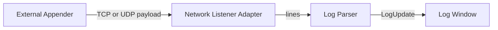

# Connectivity Design: TCP/UDP Network Log Adapters

## Purpose

This document explains what Sprint 13 (Network Log Adapters) should implement, why it matters, and which protocol expectations are realistic for log listeners.

In short: **TCP and UDP adapters turn KLogViewer into a live network log receiver** so applications can stream logs directly to the viewer without writing to local files first.

## What the TCP/UDP Adapters Are

### Core idea

Add two new `LogSource` implementations in `:core`:

- `TcpNetworkLogSource` (server socket listener)
- `UdpNetworkLogSource` (datagram listener)

Each adapter listens on a configurable host/port, converts incoming payloads into log lines, parses them with the existing parser pipeline, and emits standard `LogUpdate` events.

### Data flow in KLogViewer terms

This keeps the architecture consistent with existing file/SFTP/S3 sources by reusing `LogSource`, parser, and UI update mechanisms.

## What This Gives You

1. **Lower friction for live troubleshooting**
   - No SSH session, no remote browsing, no object polling.
   - Logs appear as the producer emits them.

2. **Support for ephemeral environments**
   - Containers/short-lived services can push logs directly while running.
   - Useful when files are not durable or not easily reachable.

3. **Multi-service aggregation in one viewer**
   - Multiple concurrent senders can stream into one window and interleave chronologically.

4. **Operational flexibility**
   - UDP mode for low overhead, best-effort telemetry.
   - TCP mode for ordered, reliable delivery.
   - Optional TLS mode for secure transport on untrusted networks.

5. **Completes ADR 010 scope**
   - ADR 010 already names a `NetworkLogSource`; this finishes the remaining connectivity leg after SFTP and S3.

## Do You Need a Standard Protocol?

Short answer: **you need at least one simple framing contract, and optionally a standard profile for compatibility.**

### Practical recommendation

Implement two protocol profiles:

1. **`plain-line` (required for Sprint 13 baseline)**
   - UTF-8 text lines separated by `\n`.
   - Works with most custom appenders and `netcat`-style emitters.
   - Minimal complexity; fastest path to value.

2. **`syslog` profile (recommended compatibility mode)**
   - Accept RFC 5424-style syslog messages over UDP/TCP.
   - Gives interoperability with standard logging infrastructure and many existing appenders.

If time is limited in Sprint 13, deliver `plain-line` first and define `syslog` as a backward-compatible extension.

### Requested compatibility targets for Sprint 13

The Sprint 13 scope should explicitly support these sender ecosystems and wire formats:

1. **Java Logback `SocketAppender`**
   - TCP ingestion profile with Logback socket payload decoding.
2. **Log4j `SocketAppender`**
   - TCP ingestion profile with Log4j socket payload decoding.
3. **NLog network targets**
   - TCP/UDP ingestion profile for common NLog network layouts.
4. **Serilog sinks**
   - TCP/UDP ingestion profile for structured and plain-text Serilog sink payloads.
5. **Python logging socket handlers**
   - Support `SocketHandler` (TCP) and `DatagramHandler` (UDP) ingestion.
6. **Logstash protocol**
   - Logstash-compatible event ingestion profile and mapping into `LogUpdate`.
7. **OpenTelemetry logs**
   - OpenTelemetry log ingestion profile and field mapping into the KLogViewer event model.

## Transport Semantics: TCP vs UDP

### TCP listener
- Connection-oriented.
- Ordered byte stream (requires line framing by delimiter).
- Better for correctness and higher fidelity capture.
- Enables TLS (`13.3.9`) and connection count display (`13.3.10`).

### UDP listener
- Datagram-oriented.
- No connection lifecycle, no delivery guarantee, possible packet loss/reordering.
- Very low overhead for noisy/telemetry-style logs.
- Should attach sender identity (`ip:port`, optional reverse DNS) to each source (`13.3.6`).

## Lightweight Protocol Definition (for 13.3.3)

### Baseline frame (`plain-line`)

- Encoding: UTF-8
- Record boundary:
  - TCP: newline (`\n`)
  - UDP: one datagram = one record (or split by newline if batched)
- Optional metadata prefix (safe extension):
  - `key=value` pairs before the message payload (example: `service=api env=dev message=...`)
- Maximum record length: configurable hard cap (drop/truncate with warning)

### Error handling

- Invalid UTF-8 or oversize payloads are dropped or truncated based on policy.
- All drops increment counters and emit warnings in listener status.

## Concurrency, Buffering, and Backpressure (13.3.4, 13.3.5)

### Required behavior

- Support many simultaneous TCP clients.
- Handle bursty UDP traffic without freezing UI.
- Use bounded channels/ring buffers between socket readers and parser pipeline.

### Overflow policy

Define explicit strategies in config:

- `drop_oldest` (default for responsiveness)
- `drop_newest`
- `block_producer` (TCP only, not recommended for UI-centric usage)

Expose dropped-message counters in status UI.

## Source Identity Model (13.3.6)

Each network stream should get a stable source key for filtering and diagnostics:

- TCP: `tcp://<remoteHost>:<remotePort>#<connectionId>`
- UDP: `udp://<remoteHost>:<remotePort>`

Display identity in source badges and allow filtering by sender.

## UI/UX Expectations (13.3.7, 13.3.8, 13.3.10)

1. Toolbar toggle: start/stop listeners.
2. Listener config persistence:
   - protocol (`tcp`/`udp`)
   - bind host/port
   - parser/profile (`plain-line`/`syslog`)
   - auto-start
   - TLS enablement and certificate references (TCP only)
3. Status bar shows:
   - running/stopped state
   - active TCP connection count
   - incoming message rate
   - dropped/overflow count

## Security Model (13.3.9)

### Baseline
- Bind to `127.0.0.1` by default.
- Warn loudly if binding to `0.0.0.0` without TLS.

### TLS for TCP
- Add `tcps`/TLS mode with server certificate and key.
- Optional mutual TLS can be a future enhancement.

### Non-goals for Sprint 15
- Full authentication/authorization layer for listener clients.
- Reliable-at-least-once delivery protocol (this is transport-level ingestion, not a queueing system).

## Suggested Incremental Delivery Plan

1. **MVP**
   - TCP + UDP listeners
   - `plain-line` framing
   - sender identity
   - bounded buffers + overflow counters
   - toolbar start/stop + persisted config

2. **Hardening**
   - multi-stream interleaving tests
   - high-volume performance tests
   - richer status telemetry
   - compatibility validation for Logback, Log4j, NLog, Serilog, and Python handlers

3. **Security/Compatibility**
   - TLS TCP mode
   - optional `syslog` profile
   - protocol profiles for Logstash and OpenTelemetry logs

## Other Protocols to Consider in Later Versions

- GELF (Graylog Extended Log Format)
- Fluentd Forward protocol
- Loki Push API
- Vector ingestion protocol
- Splunk HEC (HTTP Event Collector)
- Kafka ingestion bridge
- Windows Event Forwarding bridge

## Acceptance Mapping to Sprint 15 Tasks

Canonical task tracking file: `docs/tasks/TASKS-SPRINT-15-NETWORK-LOG-ADAPTERS.md`

- `13.3.1` / `13.3.2`: concrete TCP and UDP listener adapters in `:core`
- `13.3.3`: `plain-line` protocol profile documented and implemented
- `13.3.4`: concurrent client/session handling
- `13.3.5`: bounded buffer + overflow policy + counters
- `13.3.6`: sender identity tagging
- `13.3.7` / `13.3.8`: UI controls + persisted listener configuration
- `13.3.9`: TLS-enabled TCP listener
- `13.3.10`: listener + connection status in status bar
- `13.3.11`–`13.3.15`: framework compatibility profiles (Logback, Log4j, NLog, Serilog, Python)
- `13.3.16`: Logstash protocol ingestion profile
- `13.3.17`: OpenTelemetry logs ingestion profile
- `13.5.4` / `13.5.5`: integration/performance verification
- `13.5.6` / `13.5.7`: compatibility and protocol integration suites
- `13.6.x`: later-version protocol candidate evaluation

## Bottom Line

TCP/UDP adapters are not “just another connector”; they create a **real-time ingestion path** into KLogViewer.

If your concern is protocol ambiguity: start with a strict, tiny `plain-line` contract and optionally add syslog compatibility. That gives immediate value while keeping implementation risk controlled.