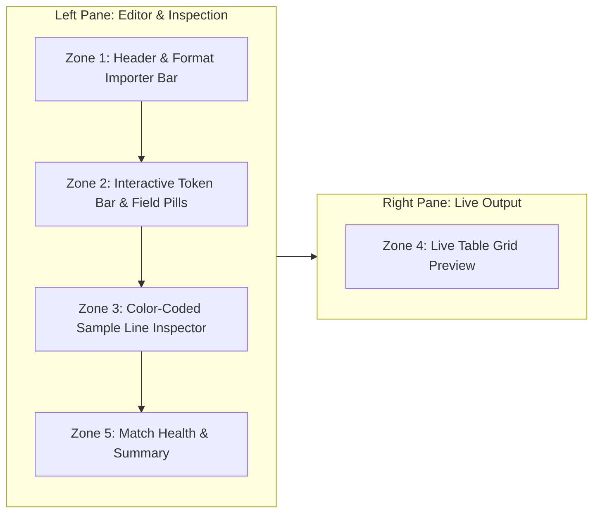

# Pattern Wizard & Field Mapping UI Design

## 1. Overview & Objective
This document defines the user interface architecture, visual layout, interactive components, and UX workflows for the **KLogViewer Pattern Wizard and Field-to-Column Mapping UI** introduced in Sprint 13.

The goal is to provide a professional-grade, interactive editing surface when opening unrecognized or heuristically detected text logs, allowing users to effortlessly inspect, import, visually customize, and verify log pattern field extractions before applying them.

---

## 2. Visual Anatomy & Zone Layout

The Pattern Wizard is presented as a wide interactive modal dialog structured into a two-column, side-by-side layout across five synchronized zones:



### Zone 1: Header & Format Importer Bar
- **Preset Dropdown**: Allows rapid selection of standard detected presets (e.g., `Logback / Log4J Standard`, `Serilog Text Layout`, `ISO8601 Simple`, `Custom Draft`).
- **Format String Importer**:
  - Text input field supporting pasted pattern strings (e.g., `%d{yyyy-MM-dd HH:mm:ss.SSS} [%thread] %-5level %logger - %msg` or `{Timestamp:yyyy-MM-dd HH:mm:ss} [{Level:u3}] {Message}`).
  - An **Import** button that immediately parses the pasted string into canonical tokens.
  - Retains the original raw format string in metadata for user reference.
- **Directory Scope Toggle**: Checkbox labeled *"Save mapping for directory (`<normalized path>`)"*, enabled by default.

### Zone 2: Interactive Token Bar (Pattern Builder)
The pattern is displayed as an ordered sequence of interactive, visual chips:
- **Field Pills**: Color-coded tokens representing extractable fields:
  - `Timestamp` (with format specifier, e.g. `yyyy-MM-dd HH:mm:ss.SSS`)
  - `Level` (e.g. `%-5level`, `[INFO]`)
  - `Thread` (e.g. `[%thread]`)
  - `Logger` / `Category` (e.g. `%logger{36}`)
  - `Message` (`%msg` / `{Message}`)
  - `Exception` / `Stack Trace`
  - `Custom Property` (named capture fields, e.g. `txId`, `userId`)
- **Delimiter Chips**: Visual literal separators (e.g., `[`, `]`, ` - `, space).
- **Token Configuration Flyout / Popover**:
  - Clicking any token pill opens a configuration popover to change:
    - Target column role (`Timestamp`, `Level`, `Thread`, `Logger`, `Message`, `Custom Property`).
    - Property name (for custom fields).
    - Format pattern (e.g., date-time format dropdown + custom format text).
    - Optional vs mandatory flag.
- **Token Actions**:
  - Drag-and-drop or left/right reordering buttons.
  - `+ Add Field` insertion points between tokens.
  - Delete / Remove token action.

### Zone 3: Color-Coded Sample Line Inspector
- Displays 5–10 sample lines extracted from the opened log file.
- **Line Navigator**: Carousel or line list selector (`Line 1 of 10`, `Next`, `Previous`).
- **Synchronized Visual Highlighting**:
  - Each extracted field span in the sample line is highlighted with the exact color background corresponding to its token pill in the Token Bar (e.g., Timestamp in Blue, Level in Green/Amber, Thread in Purple, Logger in Cyan, Message in neutral/dark tint).
  - Unmatched literal characters and delimiters are displayed with standard contrast text.
- **Point-and-Click Field Extraction**:
  - Users can select/highlight any unmapped text span in the sample line.
  - A contextual popup appears: *"Extract selected text as: [Timestamp | Level | Thread | Logger | Custom Field...]"*.
  - Selecting an option automatically inserts the appropriate token pill and delimiter chips into the Token Bar.
- **Mismatch & Error Diagnostics**:
  - Lines failing to match the pattern are marked with an error indicator.
  - The exact position where matching failed is underlined with a red wavy line and an inline tooltip explains the failure (e.g., *"Expected delimiter ']' at index 24, found 'W'"*).

### Zone 4: Live Table Grid Preview
- A compact, live-updating instance of the KLogViewer log grid (`LogList` style).
- **Dynamic Columns**: Columns are generated dynamically based on the mapped tokens: `Timestamp`, `Level`, `Thread`, `Logger`, `Message`, and any custom extracted property columns.
- **Instant Reactive Update**: As the user adjusts token pills, formats, or delimiters, the preview table reparses the sample lines and renders the resulting columns instantly.
- **Column Customization**: Users can toggle column visibility or edit target column header titles directly in the preview.

### Zone 5: Match Health & Action Bar
- **Confidence & Match Summary**:
  - Visual status pill: `✓ 10/10 sample lines matched (100%)` or `⚠️ 7/10 lines matched (3 failed)`.
  - Detailed diagnostic drawer toggle showing per-line parse status.
- **Action Buttons**:
  - `Reset to Best Guess`: Restores the initial heuristic probe detection.
  - `Cancel`: Discards draft changes without altering current window parser state.
  - `Apply & Load` (Primary): Compiles the canonical draft into a runtime `LogTemplate`, persists directory mapping in user preferences, and triggers main window reload via `LogLoadingCoordinator`.

---

## 3. Core Interaction Workflows

### Workflow A: The "Zero Effort" Best-Guess Acceptance
1. User opens an unrecognized text log file.
2. The Pattern Wizard opens automatically showing the best-guess token breakdown, color-coded sample spans, and populated preview table.
3. User inspects the preview grid; if the columns look correct, clicks **Apply & Load** (1 click).

### Workflow B: The "Paste Existing Config" Flow
1. User copies a pattern string from `logback.xml` or Serilog configuration.
2. In Zone 1, user pastes the string into the Format Importer bar and clicks **Import**.
3. The importer converts the string into canonical tokens in Zone 2.
4. Sample line highlights (Zone 3) and table columns (Zone 4) immediately reflect the imported layout.
5. User clicks **Apply & Load**.

### Workflow C: Point-and-Click Visual Customization
1. The heuristic guess mapped a timestamp and level, but left a transaction ID `[tx-9921]` embedded in the message.
2. User highlights `tx-9921` in the Sample Line Inspector (Zone 3).
3. User chooses *"Map as Custom Property: txId"* from the context popup.
4. A new token pill `[txId]` is added to the Token Bar; sample lines highlight the transaction ID in a distinct color, and a `txId` column appears in the preview table.
5. User clicks **Apply & Load**.

### Workflow D: Reopening from Active Workspace
1. User is viewing a log file and realizes a field format is slightly off.
2. User clicks the parser status chip in `StatusBar.kt` or chooses *Edit Pattern Mapping...* from the menu.
3. The wizard reopens with the currently active pattern pre-populated as the editable draft.
4. User makes edits, verifies the preview, and clicks **Apply & Load** or **Cancel** (leaving active view unchanged).

---

## 4. Color Palette & Token Roles

To ensure high readability in both Dark and Light themes, tokens and sample spans share a unified semantic palette:

| Token Role | Semantic Purpose | Dark Theme Accent | Light Theme Accent |
| :--- | :--- | :--- | :--- |
| **Timestamp** | Date and time extraction | Soft Blue (`#4A90E2`) | Royal Blue (`#1976D2`) |
| **Level** | Severity (`INFO`, `WARN`, `ERROR`, etc.) | Emerald Green (`#2ECC71`) / Amber | Green (`#388E3C`) / Amber |
| **Thread** | Thread name or ID | Violet / Purple (`#9B59B6`) | Deep Purple (`#7B1FA2`) |
| **Logger** | Class or logger name | Teal / Cyan (`#1ABC9C`) | Teal (`#00796B`) |
| **Message** | Primary log message text | Muted Slate (`#95A5A6`) | Cool Gray (`#546E7A`) |
| **Exception** | Stack trace / error details | Coral Red (`#E74C3C`) | Deep Red (`#C62828`) |
| **Custom Property** | Extracted custom fields (e.g. `txId`) | Amber / Orange (`#F39C12`) | Dark Orange (`#E65100`) |
| **Delimiter** | Literal text between tokens | Low-contrast Gray (`#7F8C8D`) | Slate (`#9E9E9E`) |

---

## 5. Compose UI Component Architecture

The UI implementation is cleanly factored into modular Compose components under `ui/src/main/kotlin/com/klogviewer/ui/components/pattern/`:

```
ui/src/main/kotlin/com/klogviewer/ui/components/pattern/
├── PatternWizardDialog.kt         # Top-level modal container & layout orchestration
├── PatternImporterBar.kt          # Preset dropdown, format string paste input, import trigger
├── PatternTokenBar.kt             # Token pill flow-row, drag/reorder, delimiter chips, '+ Add'
├── PatternTokenConfigPopover.kt   # Token role, property name, and date/regex format editor
├── SampleLineInspector.kt         # Annotated sample line viewer with color spans & text selection
├── SampleLineSelectionPopup.kt    # Contextual popup for point-and-click text span extraction
├── PatternTablePreview.kt         # Live sample table grid with dynamic column headers
└── PatternMatchSummary.kt         # Match confidence badge, error diagnostics drawer
```

### Component Responsibilities

1. **`PatternWizardDialog`**:
   - Manages top-level dialog layout, title bar, close/cancel/apply handlers, and scroll/split containers.
   - Binds to `KLogViewerState.patternWizardState`.
2. **`PatternImporterBar`**:
   - Renders preset selections, paste text box, and import button.
   - Emits `ImportPatternIntent` on submission.
3. **`PatternTokenBar`**:
   - Renders the ordered sequence of tokens and delimiters.
   - Handles pill click (opening `PatternTokenConfigPopover`), token deletion, and token reordering.
4. **`PatternTokenConfigPopover`**:
   - Flyout dialog positioned next to selected token pill.
   - Allows changing column role, custom field name, and format string.
5. **`SampleLineInspector`**:
   - Renders sample lines with monospace font and annotated text background spans matching token colors.
   - Provides line carousel navigation (`Prev`, `Next`, `Line X of Y`).
   - Listens for text selection events to trigger `SampleLineSelectionPopup`.
6. **`SampleLineSelectionPopup`**:
   - Floating context action bar when text is selected in sample lines.
   - Offers quick-mapping actions to create a new token from the selected span.
7. **`PatternTablePreview`**:
   - Compact table renderer that takes parsed sample entries and displays them in columns matching mapped token names and roles.
8. **`PatternMatchSummary`**:
   - Calculates match ratio (e.g., 10/10 matched).
   - Displays parse warning/error badges and details on failed lines.

---

## 6. Interaction Polish & Professional Details

These details are what separate a professional-grade editor from a functional dialog. They are in scope for Sprint 13 unless explicitly deferred in `docs/deferred_decisions.md`.

### 6.1. Bidirectional Hover Synchronization
- Hovering a token pill in Zone 2 highlights (glow/outline) the corresponding spans in every visible sample line and the matching column header in the preview table.
- Hovering a colored span in a sample line highlights its owning token pill and column.
- This makes the pattern → line → column relationship instantly legible without reading any text.

### 6.2. Undo / Redo Inside the Wizard
- Every draft mutation (token add/remove/reorder/reconfigure, import, span extraction) is pushed onto an in-wizard undo stack.
- `Cmd/Ctrl+Z` / `Cmd/Ctrl+Shift+Z` operate only on the draft; the active parser is never involved.
- `Reset to Best Guess` is itself undoable.

### 6.3. Keyboard & Focus Model
- `Esc` closes (non-destructive cancel), `Cmd/Ctrl+Enter` applies.
- Full tab-order traversal across zones; arrow keys move selection between token pills; `Delete` removes the focused pill.
- Popovers open with `Enter`/`Space` on a focused pill and restore focus on close.

### 6.4. Preview Performance Budget
- Draft edits recompile the preview against sampled lines with a short debounce (~150 ms) so typing in a format field never stutters.
- Preview parsing runs off the UI thread; stale results are discarded when a newer draft supersedes them.
- Target: visible preview update within 250 ms of the last edit for 10 sample lines.

### 6.5. Sampling Controls
- Default sample is drawn from the head of the file, but a **Resample** control lets the user pull lines from the middle and tail (long-running logs often change shape after startup).
- Multiline entries (stack traces) are shown as grouped continuation lines in the inspector so users can see how the pattern treats them.
- Very long lines are soft-wrapped with a per-line expand toggle rather than truncated silently.

### 6.6. Escape Hatches & Confidence Behavior
- A **Skip — open as plain text** action is always available so the wizard never blocks a user who just wants to see the file.
- When the heuristic confidence is very high (all sampled lines match a known template), the wizard can open pre-collapsed to a slim confirmation banner ("Detected Logback layout — Apply / Review / Skip") instead of the full editor.
- If a saved directory mapping stops matching a newly opened file (below a match threshold), the wizard reopens with the saved mapping preloaded and a clear diagnostic instead of silently producing garbage rows.

### 6.7. Dialog Ergonomics
- The wizard is resizable with a sensible minimum size; size and the collapsed/expanded state are remembered across sessions.
- Zones 3 and 4 share a draggable vertical splitter.
- Pill insert/remove/reorder use subtle (<150 ms) animations; no animation on preview reparse to keep it feeling instant.
- Level values in the preview table reuse the exact badge styling of the main log table so "what you preview is what you get".

### 6.8. Saved Mapping Management
- A lightweight management surface (settings section or wizard menu) lists saved directory mappings with directory key, source type (local/SFTP/S3), pattern summary, and last-used time, and supports delete and open-in-wizard actions.

### 6.9. Component Previews for HITL
- Every component under `ui/components/pattern/` ships with `@Preview` composables (light + dark, matched + error states) so HITL reviews can render the UI headlessly before full integration.
