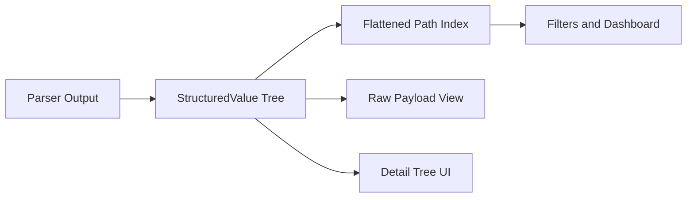

# Sprint 12: Structured Data Logging

## 1. Problem Statement

### 1.1 Why plain-text parsing is insufficient

KLogViewer currently works well for line-oriented plain text and template logs, but modern observability stacks emit
increasingly structured records (JSON, logfmt, wrapped cloud/container payloads, and OpenTelemetry-shaped fields). A
plain-text-first model makes it hard to:

- inspect nested request/response metadata,
- reliably extract correlation keys (`traceId`, `spanId`, `RequestId`),
- distinguish message template from rendered message,
- and build precise, typed filters for dashboards and troubleshooting.

### 1.2 What structured data logging means for KLogViewer

For this sprint, “structured data logging” means first-class ingestion and inspection of typed structured payloads while
preserving current workflows. The target user experience includes:

- preserving raw source fields,
- deriving canonical fields (`timestamp`, `level`, `message`, `logger`, `exception`, `trace.id`, `span.id`,
  request/correlation IDs),
- addressing nested fields by path (`http.request.method`, `Properties.UserId`, `attributes.http.status_code`),
- and using those fields in filtering, column discovery, dashboard analysis, and detail inspection.

### 1.3 User workflows this sprint must enable

- Investigate production incidents by filtering on canonical and ecosystem-specific IDs (for example, `trace.id`,
  `TraceId`, `@tr`).
- Pivot from a high-level dashboard into exact structured dimensions without losing compatibility with existing plain
  logs.
- Inspect deeply nested payloads and wrapped container/cloud events without manual reformatting.
- Work across mixed sources (JVM, .NET, containers, cloud envelopes) in the same window.

### 1.4 Why cross-ecosystem support matters

KLogViewer users inspect logs produced by heterogeneous services and runtimes. Sprint 12 must explicitly support
conventions from JVM (Logback/Log4j2/Spring), .NET (MEL/Serilog/NLog/log4net), and container/cloud wrappers so users can
run one consistent investigation flow instead of format-specific workarounds.

## 2. Current State Analysis

### 2.1 Domain and parser contract realities

- `domain/src/main/kotlin/com/klogviewer/domain/model/LogEntry.kt` stores structured metadata as
  `fields: Map<String, String>`.
- `domain/src/main/kotlin/com/klogviewer/domain/parser/LogParser.kt` exposes
  `parse(line): Either<LogFailure.ParsingError, LogEntry>`.
- Current model is flat string-only. It cannot represent typed/nested values without lossy conversion.

### 2.2 Existing structured/semi-structured parser behavior

#### JSON parser (`core/.../JsonLogParser.kt`)

- Parses one-line JSON objects.
- Supports configurable key mapping (`timestampKey`, `levelKey`, `contentKey`).
- Converts non-primitive nested values to string form via `toString()`.
- Writes normalized core fields (`timestamp`, `level`, `content`) into `LogEntry.fields` and copies remaining keys as
  flat string fields.

#### logfmt parser (`core/.../LogfmtParser.kt`)

- Parses `key=value` pairs with quoted value support.
- Maps selected keys to timestamp/level/content and flattens remaining pairs into `fields`.
- No typed value preservation; all values are persisted as strings.

#### XML support

- No XML parser implementation currently exists in `:core` parser package.
- XML is mentioned in docs/ADR context, but not in runtime parser selection.

### 2.3 Detection and parser selection

- `core/src/main/kotlin/com/klogviewer/core/parser/HeuristicProbe.kt` detection order:
    1. JSON (shape check + key probing)
    2. template parser matching
    3. logfmt detection
    4. fallback to template/simple parser
- Current alias probing for JSON mapping is limited:
    - timestamp: `timestamp`, `time`, `ts`
    - level: `level`, `lvl`, `severity`
    - content: `message`, `msg`, `content`, `body`
- No confidence-score object is exposed today; behavior is majority-threshold heuristic.

### 2.4 Filtering, dashboard, and field-frequency flow

- `ui/.../LogFilterService.kt` supports:
    - free-text match on `content` and `timestamp`,
    - dashboard-generated field filter syntax `@field:key=value` (contains, case-insensitive).
- `ui/.../KLogViewerViewModel.kt` discovers dashboard dimensions from `entry.fields.keys`.
- `core/.../InMemoryAnalysisMetricsRepository.kt` groups frequency by `entry.fields[fieldKey]` with `(missing)`
  fallback.
- Net effect: analysis is limited to flat string keys and does not support nested paths, typed comparison, or array
  semantics.

### 2.5 Log list, detail pane, and parser override path

- `ui/.../LogList.kt` resolves non-core columns by lowercasing/normalizing the column name and looking up
  `entry.fields[fieldName]`.
- `ui/.../LogEntryDetails.kt` renders flat key/value rows; no structured tree view or raw structured payload toggle.
- Parser override is available and already integrated:
    - user action via `KLogViewerIntent.ChangeParser`
    - handled through `TabWindowIntentHandler` + `WorkspaceLogLoader.getParserResultByName(...)`
    - surfaced in `ui/.../StatusBar.kt`
    - persisted with `parserName` in `domain/.../UserPreferences.kt`.

### 2.6 Strengths to preserve

- Clear parser boundary with `Either`-based error handling.
- Existing JSON/logfmt ingestion foundation.
- Existing parser override UX and persistence model.
- Existing dashboard and filtering pipelines that can be extended to structured path indexing.

### 2.7 Gaps, constraints, and risks

- Flat `Map<String, String>` cannot preserve type, nesting, arrays, or repeated path values.
- Nested objects are currently stringified, preventing robust structured filtering.
- Alias detection is too narrow for real JVM/.NET/cloud formats.
- No XML implementation and no mixed-structure confidence model.
- UI detail pane and table model are optimized for flat fields only.
- Risk: adding structured capabilities without a new data abstraction can create incompatible behavior across filtering,
  dashboard metrics, and detail rendering.

## 3. Target Capabilities

### 3.1 Format handling targets

- JSON: detect and parse one-line JSON, nested JSON, and JSON embedded in container/cloud wrappers.
- logfmt: preserve existing support and normalize common keys while documenting type/escaping limits.
- XML: include structured XML support in sprint scope as best-effort parsing with predictable fallback.
- Mixed files: support graceful coexistence of plain-text and structured lines in the same source.

### 3.2 Canonical field normalization + alias mapping

Canonical fields are additive projections and must not overwrite raw source keys.

| Canonical concept | Aliases to recognize (non-exhaustive)                                                          |
|-------------------|------------------------------------------------------------------------------------------------|
| `timestamp`       | `timestamp`, `@timestamp`, `time`, `ts`, `@t`, `Timestamp`, `timeUnixNano`                     |
| `level`           | `level`, `severity`, `log.level`, `lvl`, `@l`, `Level`, `LogLevel`, `severityText`             |
| `message`         | `message`, `msg`, `event`, `body`, `@m`, `@mt`, `Message`, `RenderedMessage`, `OriginalFormat` |
| `logger`          | `logger`, `logger_name`, `log.logger`, `SourceContext`, `Category`, `CategoryName`, `category` |
| `thread`          | `thread`, `thread_name`, `process.thread.name`, `ThreadId`, `ThreadName`                       |
| `exception`       | `exception`, `error`, `stack_trace`, `stackTrace`, `Exception`, `@x`                           |
| `trace.id`        | `traceId`, `trace_id`, `trace.id`, `TraceId`, `@tr`                                            |
| `span.id`         | `spanId`, `span_id`, `span.id`, `SpanId`, `@sp`                                                |
| `correlation.id`  | `RequestId`, `CorrelationId`, `connectionId`, `ConnectionId`, `ActivityId`                     |

### 3.3 Nested path addressing and namespace handling

- Use dot-path addressing for nested access (for example `http.request.method`, `exception.stacktrace`, `user.id`).
- Preserve ecosystem namespaces exactly when present:
    - Serilog `Properties.*`
    - OTel-style `attributes.*`, `resource.*`, `scope.*`
    - wrapper namespaces like `docker.*`, `kubernetes.*`, `cloud.*`
- Support both canonical path lookup and exact raw key lookup.

### 3.4 Raw + normalized dual view

- Keep full raw structured payload for inspection/export.
- Derive canonical fields side-by-side for table/filter/dashboard use.
- When both template and rendered messages exist, keep both and define deterministic display priority in parser design.

### 3.5 Structured architecture decision (confirmed)

Sprint 12 implementation planning targets a **typed tree + flattened path index** model.

## 4. Structured Data Model

### 4.1 Conceptual model

- `StructuredValue` tree supports: `string`, `number`, `boolean`, `null`, `object`, `array`.
- Each parsed structured payload produces:
    1. raw typed tree for detail rendering,
    2. flattened path index for fast lookup/filter/dashboard queries,
    3. canonical view for common fields.

### 4.2 Flattened path index rules

- Objects: `parent.child` path composition.
- Arrays:
    - preserve full array at parent path,
    - index element paths with ordinal keys (`items[0].id`) for deterministic targeting,
    - support non-ordinal any-match semantics in query layer (defined in Section 7).
- Repeated keys (across wrappers/merged sources) are represented as multi-value path entries rather than destructive
  overwrite.

### 4.3 Canonical projection contract

- Canonical projection is derived from raw/indexed data.
- Canonical fields remain optional; missing canonical fields do not invalidate a parsed record.
- Canonical and raw values are independently addressable for UI and filters.

### 4.4 Namespace preservation

- Serilog: maintain `Properties.*`, `Renderings`, and compact fields (`@t`, `@mt`, `@m`, `@l`, `@x`, `@i`, `@tr`,
  `@sp`).
- OTel-shaped logs: maintain `resource.*`, `scope.*`, `attributes.*`, and identity fields.
- Container/cloud wrappers: keep envelope metadata (stream/time/container IDs) and nested application payload separately
  addressable.

### 4.5 Backward compatibility constraints

- Existing `LogEntry.fields` consumers (table/filter/dashboard) remain functional via compatibility projection during
  rollout.
- New model must support incremental adoption without breaking parser override behavior or saved user parser
  preferences.

## 5. Parser Design

### 5.1 Parser responsibilities and boundaries

- Parsers are responsible for:
    - extracting raw structured payload,
    - generating canonical field candidates,
    - producing path-indexable data,
    - reporting parse confidence and recoverable failures.
- Existing `LogParser` contract remains the compatibility boundary; sprint implementation may introduce an internal
  structured parse result adapter before projecting to `LogEntry`.

### 5.2 JSON behavior

- Accept object-based JSON log lines by default.
- For invalid JSON lines:
    - mark parse as failed for structured parser,
    - fallback to template/simple parser via detection pipeline.
- For mixed files, select parser per source with per-record graceful fallback.
- For multiline/pretty JSON, define staged handling:
    - initial sprint: line-based parse + fallback,
    - optional buffered multiline heuristics behind clear limits.

### 5.3 XML behavior

- XML support target: **best-effort structured extraction** in sprint scope.
- Extract attributes/text nodes into typed/object model where feasible.
- On malformed XML or unsupported constructs, degrade gracefully to plain content without crashing load/tail flow.

### 5.4 logfmt behavior

- Keep key/value extraction as baseline.
- Add canonical alias recognition on logfmt keys.
- Preserve raw logfmt pairs and expose normalized canonical fields separately.

### 5.5 Confidence scoring + fallback model

- Detection strategy shifts from binary majority checks to parser confidence scoring per source sample.
- Candidate score factors:
    - parse success ratio,
    - canonical key hit rate,
    - structural depth signal,
    - malformed record ratio.
- Fallback policy:
    - if confidence below threshold, choose current `TemplateLogParser` / `SimpleLogParser` path,
    - do not block ingestion when structured parsing is uncertain.

### 5.6 .NET-specific parsing recommendations

- Serilog compact/rendered compact:
    - map `@t/@l/@m/@mt/@x/@i/@tr/@sp` into canonical and raw namespaces,
    - maintain `Properties.*` as raw structured namespace.
- MEL JSON console:
    - detect `Timestamp`, `LogLevel`, `Category`, `EventId`, `Message`, `{OriginalFormat}`, `Scopes`.
- NLog/log4net JSON layouts:
    - treat logger/level/message/exception/context fields as normalizable aliases,
    - preserve emitter-specific field names untouched in raw namespace.

## 6. Integration Points

### 6.1 Heuristic detection and parser selection

- Extend `HeuristicProbe` to produce confidence-ranked parser candidates.
- Keep status-bar parser override as final authority over auto-detection.

### 6.2 Workspace loading and tailing

- Integrate structured parse projection in `WorkspaceLogLoader` and live tail flows without breaking current source
  abstractions (`FileLogSource`, `DirectoryLogSource`).
- Apply bounded processing for malformed bursts so tailing remains responsive.

### 6.3 Columns and discoverability

- Continue generating default columns from canonical fields.
- Add discovered structured paths as opt-in columns with limits (detailed in Section 9).
- Preserve current behavior for unstructured rows in mixed datasets.

### 6.4 Filtering integration

- Route query evaluation through flattened path index and canonical alias resolver.
- Keep backward compatibility for existing free-text and dashboard-generated field queries.

### 6.5 Dashboard/frequency integration

- Frequency dimensions should be selectable from canonical fields and discovered path index keys.
- Preserve current `(missing)` bucket semantics for absent values.

### 6.6 Detail pane integration

- Add structured tree inspector backed by `StructuredValue`.
- Add raw payload toggle (raw JSON/XML/text) without removing existing content highlights.

### 6.7 Persistence and settings

- Preserve `parserName` persistence in `WindowPreference`.
- Add future-compatible storage for field alias customizations and column preferences without requiring migration in
  this sprint document task.

### 6.8 Cross-ecosystem normalization strategy

- Normalization pipeline:
    1. parse raw structured payload,
    2. compute canonical candidates,
    3. resolve priority/precedence rules,
    4. publish canonical + raw views together.
- Priority defaults emphasize rendered message for user-facing content while preserving template metadata for
  diagnostics.

## 7. Filtering Requirements

### 7.1 Query model overview

Filtering must support both backward-compatible free text and structured path-aware predicates.

Supported high-level forms:

- free text: `timeout`, `message contains "connection reset"`
- canonical short form: `level:error`, `has:trace.id`
- explicit field predicates: `field:user.id=123`, `field:StatusCode >= 500`
- explicit namespace/path predicates: `field:Properties.UserId="abc"`, `json.http.status >= 500`

### 7.2 Predicate types

- Exact: `field:trace.id = "abc123"`
- Contains: `field:exception contains "Timeout"`
- Regex: `field:RequestPath ~ "^/api/orders/.*$"`
- Numeric comparison: `field:StatusCode >= 500`, `field:Elapsed < 250`
- Boolean/null:
    - `field:isHealthy = true`
    - `field:error = null`
- Exists/missing:
    - `field:TraceId exists`
    - `field:CorrelationId missing`
    - `has:trace.id` (alias for canonical exists)

### 7.3 Escaping and quoting rules

- Field paths with dots are interpreted as nested paths by default.
- Literal field names containing dots must be escaped with backticks:
    - ``field:`kubernetes.labels.app.kubernetes.io/name` = "api"``
- Quoted strings support escaped quote characters.
- Unquoted values are parsed as string unless numeric/boolean/null tokens are unambiguous.

### 7.4 Array semantics

- `exists` on an array path is true when the array exists and is non-empty.
- Equality/comparison against array paths uses any-match semantics by default.
- Exact array equality remains opt-in via explicit syntax (`field:items == ["a","b"]`) if implemented.
- Index-based lookup (`items[0].id`) is supported for deterministic targeting.

### 7.5 Canonical alias search behavior

- Canonical query terms must fan out to ecosystem aliases.
- Example: `trace.id = "X"` matches any of `trace.id`, `traceId`, `TraceId`, `@tr`.
- Raw-path queries remain exact when explicitly targeted (`field:Properties.UserId=...`).

### 7.6 Backward compatibility

- Existing free-text behavior stays unchanged.
- Existing dashboard-generated query syntax `@field:key=value` continues to work and is translated into structured
  predicate form internally.

## 8. UI/UX Requirements

### 8.1 Detail pane structured inspector

- Add expandable/collapsible structured tree for object/array payloads.
- Show type badges (string/number/bool/null/object/array) for clarity.
- Preserve current plain content block for non-structured rows.

### 8.2 Raw view toggle

- Provide `Structured` vs `Raw` toggle in details pane.
- Raw mode supports JSON/XML/plain payload presentation with truncation safeguards.

### 8.3 Field actions

- Context actions on nodes/values:
    - `Copy field path`
    - `Copy value`
    - `Filter by this field`
    - `Filter by this value`

### 8.4 Table and marker behavior

- Visual marker in list rows indicates presence of structured payload.
- Column picker can include discovered structured paths (bounded by limits in Section 9).
- Canonical columns (`Timestamp`, `Level`, `Message`) remain stable defaults.

### 8.5 Ecosystem grouping labels

Details view should group/label known namespaces:

- `Serilog Properties`
- `OpenTelemetry Attributes`
- `Container Envelope`
- `ASP.NET Core Request Metadata`

### 8.6 Large-payload safety UX

- Virtualize tree rendering where possible.
- Truncate very large scalar values with explicit “show more” interaction.
- Keep UI responsive under deep nesting and high-field cardinality.

## 9. Performance and Memory Constraints

### 9.1 Parsing and indexing strategy

- Eagerly extract minimal canonical fields required for list rendering.
- Build/refresh full typed tree + path index lazily for oversized payloads and cache results per entry.
- Cache must be bounded and evictable (LRU or equivalent strategy).

### 9.2 Default guardrails (configurable)

- Maximum structured payload size for full parsing: `1 MB` per record.
- Maximum nesting depth: `32`.
- Maximum discovered field paths per session window: `5,000`.
- Maximum auto-suggested columns from discovered fields: `50`.
- Maximum array elements indexed per path for UI/filter discoverability: `200`.

### 9.3 Live updates and streaming

- Do not block tail ingestion on structured parse failures.
- Apply time-budgeted batching for index updates during high-throughput tailing.
- Defer non-critical enrichment (for example low-priority namespace grouping) when UI is under load.

### 9.4 High-cardinality field handling

- Treat IDs/URLs/user keys as high-cardinality by default.
- Limit dashboard top-N computations and provide `(other)` aggregation where applicable.
- Preserve ability to filter by high-cardinality keys even when not auto-promoted to columns.

## 10. Compatibility with Real Logging Ecosystems

### 10.1 Compatibility matrix (JVM)

| Format                         | Representative sample                                                                                                                                                   | Expected extraction summary                                                                                                                      |
|--------------------------------|-------------------------------------------------------------------------------------------------------------------------------------------------------------------------|--------------------------------------------------------------------------------------------------------------------------------------------------|
| Logstash Logback JSON          | `{"@timestamp":"2026-06-05T09:10:11Z","level":"INFO","logger_name":"com.app.OrderSvc","message":"order accepted","traceId":"abc","spanId":"def","mdc":{"userId":"42"}}` | `timestamp=@timestamp`, `level=level`, `message=message`, `logger=logger_name`, `trace.id=traceId`, `span.id=spanId`, raw `mdc.userId` preserved |
| Logback JSON + MDC             | `{"timestamp":"...","level":"WARN","message":"retry","thread_name":"http-nio-1","requestId":"r-1","mdc":{"tenant":"acme"}}`                                             | canonical timestamp/level/message/thread/correlation, raw `mdc.*` paths indexed                                                                  |
| Spring Boot structured         | `{"timestamp":"...","level":"ERROR","logger_name":"org.springframework...","message":"failed","exception":"...stack..."}`                                               | canonical exception populated from `exception`, logger from `logger_name`                                                                        |
| Log4j2 JSONLayout/JsonTemplate | `{"timeMillis":1710000000000,"level":"INFO","loggerName":"svc","message":"ok","thrown":{"extendedStackTrace":[...]}}`                                                   | timestamp normalized from `timeMillis`, logger from `loggerName`, exception from `thrown.*` raw + canonical                                      |

### 10.2 Compatibility matrix (.NET)

| Format                       | Representative sample                                                                                                                                                                                                    | Expected extraction summary                                                                                           |
|------------------------------|--------------------------------------------------------------------------------------------------------------------------------------------------------------------------------------------------------------------------|-----------------------------------------------------------------------------------------------------------------------|
| MEL JSON console             | `{"Timestamp":"...","LogLevel":"Information","Category":"My.Api","Message":"Handled","EventId":1,"Scopes":[{"RequestId":"r1"}]}`                                                                                         | canonical timestamp/level/logger/message; raw event/scopes preserved; correlation extracted from scopes where present |
| Serilog compact JSON         | `{"@t":"...","@mt":"Processed {OrderId}","@l":"Information","@x":null,"@tr":"abc","@sp":"def","OrderId":123}`                                                                                                            | canonical timestamp/level/template/trace/span, plus raw compact keys preserved                                        |
| Serilog rendered compact     | `{"@t":"...","@m":"Processed 123","@l":"Information","@i":"evt","Properties":{"UserId":"u-1"}}`                                                                                                                          | rendered message primary; event id retained; `Properties.UserId` indexed                                              |
| Serilog standard sink        | `{"Timestamp":"...","Level":"Error","MessageTemplate":"Failed {Path}","RenderedMessage":"Failed /api","Exception":"...","Properties":{"RequestPath":"/api"}}`                                                            | canonical message from rendered + template retained; exception and request paths normalized                           |
| Serilog ASP.NET Core request | `{"@mt":"HTTP {RequestMethod} {RequestPath} responded {StatusCode} in {Elapsed:0.0000} ms","RequestMethod":"GET","RequestPath":"/orders","StatusCode":500,"Elapsed":12.3,"RequestId":"r1","TraceId":"t1","SpanId":"s1"}` | canonical request/correlation fields extracted and filterable; template retained                                      |
| NLog JSON layout             | `{"time":"...","level":"Info","logger":"Api","message":"done","exception":"...","mdlc":{"CorrelationId":"c1"}}`                                                                                                          | canonical timestamp/level/logger/message/exception + raw context namespace                                            |
| log4net JSON-style           | `{"timestamp":"...","level":"WARN","logger":"Repo","message":"slow","thread":"8","properties":{"tenant":"acme"}}`                                                                                                        | canonical thread/logger/message + raw `properties.*` indexed                                                          |
| .NET OTel-shaped             | `{"timeUnixNano":"...","severityText":"INFO","body":"ok","traceId":"abc","spanId":"def","attributes":{"http.method":"GET"},"resource":{"service.name":"orders"}}`                                                        | canonical timestamp/level/message/trace/span + raw `attributes.*` and `resource.*` namespaces                         |

### 10.3 Compatibility matrix (container/cloud/general)

| Format                        | Representative sample                                                                                                                                   | Expected extraction summary                                                                                        |
|-------------------------------|---------------------------------------------------------------------------------------------------------------------------------------------------------|--------------------------------------------------------------------------------------------------------------------|
| Docker wrapper                | `{"log":"{\"level\":\"info\",\"message\":\"started\"}","stream":"stdout","time":"2026-..."}`                                                            | envelope fields preserved (`stream`,`time`), nested app JSON parsed and canonicalized                              |
| Kubernetes/CRI wrapper        | `2026-... stdout F {"level":"error","message":"failed","traceId":"t1"}`                                                                                 | wrapper metadata retained; structured body parsed for canonical fields                                             |
| Cloud envelope nested payload | `{"timestamp":"...","resource":{"labels":{"pod_name":"api"}},"jsonPayload":{"severity":"ERROR","message":"boom","logging.googleapis.com/trace":"..."}}` | envelope/resource preserved; nested payload fields mapped to canonical severity/message/trace                      |
| logfmt                        | `time=2026-... level=info msg="done" request_id=r1`                                                                                                     | canonical timestamp/level/message/correlation from key-value pairs                                                 |
| Nested JSON + arrays          | `{"message":"batch","items":[{"id":1},{"id":2}],"user":{"id":"u1"}}`                                                                                    | indexed `items[0].id`, `items[1].id`, `user.id`; array any-match filtering enabled                                 |
| XML                           | `<event ts="2026-..." level="WARN"><message>slow</message><exception>...</exception></event>`                                                           | best-effort canonical extraction for timestamp/level/message/exception; raw XML fallback on unsupported constructs |

### 10.4 Expected canonical extraction checklist (all ecosystem rows)

For each compatibility fixture, expected outcomes must explicitly validate:

- timestamp
- level
- message/content (and template when present)
- logger/category
- exception/stack trace
- trace/span/correlation IDs
- request metadata (`RequestPath`, `RequestMethod`, `StatusCode`, `Elapsed` when present)
- raw structured fields and namespaces preserved.

## 11. .NET-Specific Field Normalization

### 11.1 Serilog normalization rules

- `@t` -> canonical `timestamp`
- `@mt` -> canonical `message.template`
- `@m` -> canonical `message` (rendered)
- `@l` -> canonical `level`
- `@x` -> canonical `exception`
- `@i` -> canonical `event.id`
- `@tr` -> canonical `trace.id`
- `@sp` -> canonical `span.id`
- `SourceContext` -> canonical `logger`
- `Properties.*` -> raw structured namespace (indexed and filterable)
- `RequestId`, `CorrelationId`, `TraceId`, `SpanId` -> canonical correlation projections

Message priority when both template and rendered variants exist:

1. Display canonical `message` from rendered (`@m`/`RenderedMessage`) in list/detail primary content.
2. Preserve template (`@mt`/`MessageTemplate`) as separate inspectable field.

### 11.2 Microsoft.Extensions.Logging normalization rules

- `Timestamp`/`timestamp` -> `timestamp`
- `LogLevel`/`Level` -> `level`
- `Category`/`CategoryName` -> `logger`
- `EventId`/`EventName` -> `event.id`/`event.name`
- `Message`/`FormattedMessage` -> `message`
- `{OriginalFormat}`/`OriginalFormat` -> `message.template`
- `Scopes` -> raw scope namespace + candidate correlation extraction
- `Exception` -> `exception`
- ASP.NET Core fields:
    - `RequestPath` -> `http.request.path`
    - `RequestMethod` -> `http.request.method`
    - `StatusCode` -> `http.response.status_code`
    - `Elapsed` -> `http.server.duration_ms`
    - `ConnectionId`/`TraceId`/`SpanId` -> canonical connection/trace/span projections

### 11.3 NLog normalization rules

- `time`/`timestamp`/`longdate` -> `timestamp`
- `level` -> `level`
- `logger` -> `logger`
- `message` -> `message`
- `exception` and exception-layout outputs -> `exception`
- MDLC/scope/context properties -> raw structured namespace + canonical correlation candidates when matched

### 11.4 log4net normalization rules

- `timestamp`/`date` -> `timestamp`
- `level` -> `level`
- `logger` -> `logger`
- `message` -> `message`
- `thread` -> canonical `thread`
- logical/thread context properties -> raw structured namespace
- exception fields -> canonical `exception`

### 11.5 Conflict resolution policy

- If both canonical and ecosystem-specific candidates exist with different values:
    - preserve all raw values,
    - select canonical value by precedence table (format-native primary key first, alias fallback second),
    - expose conflict metadata for diagnostics/testing.

## 12. Implementation Workstreams

### 12.1 Domain model and compatibility projection

- [ ] Introduce typed structured payload model (`StructuredValue`) and flattened path index contract in `:domain`.
- [ ] Add canonical projection contract for `timestamp`, `level`, `message`, `logger`, `thread`, `exception`,
  `trace.id`, `span.id`, `correlation.id`.
- [ ] Define compatibility projection back to `LogEntry.fields` for existing consumers during rollout.

### 12.2 Parser and detection implementation

- [ ] Extend JSON parser to preserve nested typed structures and populate canonical + raw projections.
- [ ] Implement XML parser (best-effort tier) with safe fallback on malformed/unsupported records.
- [ ] Upgrade logfmt handling to preserve raw pairs and normalize aliases.
- [ ] Add confidence-based parser scoring in `HeuristicProbe` and deterministic fallback policy.

### 12.3 Normalization and alias mapping

- [ ] Implement canonical alias resolver with JVM/.NET/container/cloud mappings.
- [ ] Add conflict-resolution precedence rules and diagnostics metadata.
- [ ] Add namespace-preservation rules for `Properties.*`, `attributes.*`, `resource.*`, `scope.*`, and wrappers.

### 12.4 Filtering engine enhancements

- [ ] Implement structured filter grammar parser (`exact`, `contains`, `regex`, numeric compare, `exists`, `missing`,
  `null`).
- [ ] Implement canonical alias fan-out behavior (for example `trace.id` -> `TraceId`, `traceId`, `@tr`).
- [ ] Add array any-match semantics and index-addressed semantics (`items[0].id`).
- [ ] Preserve backward compatibility for existing free-text and `@field:key=value` queries.

### 12.5 UI details and log list integration

- [ ] Add structured detail tree component with expandable object/array nodes.
- [ ] Add raw/structured toggle and value truncation safeguards.
- [ ] Add field actions: copy path/value and “filter by this field/value”.
- [ ] Add structured-row visual indicator and bounded discovered-field column integration.

### 12.6 Dashboard and analysis integration

- [ ] Extend dashboard field discovery to use canonical + path-indexed fields.
- [ ] Extend frequency analysis to operate on indexed structured paths.
- [ ] Preserve `(missing)` handling and add cardinality guardrails for high-cardinality fields.

### 12.7 Settings and persistence

- [ ] Keep parser override behavior and `parserName` persistence unchanged.
- [ ] Add persistence model for future custom alias mappings and discovered column preferences.

### 12.8 Documentation and ADR alignment

- [ ] Update `docs/adr/adr-009-structured-data-support.md` with final implementation direction if decisions change.
- [ ] Update `README.md` structured logging capabilities and filter syntax once implementation is merged.
- [ ] Keep terminology aligned with `docs/UBIQUITOUS_LANGUAGE.md`.

### 12.9 Compatibility fixture tracks

- [ ] JVM fixture pack: Logstash/Logback, Log4j2 JSONLayout/JsonTemplate, Spring Boot JSON + MDC.
- [ ] .NET fixture pack: MEL JSON console, Serilog compact/rendered/standard/request, NLog JSON, log4net JSON-style,
  .NET OTel-shaped.
- [ ] Container/cloud fixture pack: Docker wrapper, CRI wrapper, cloud nested envelope payloads.
- [ ] General fixture pack: logfmt, nested arrays, XML, invalid/mixed files.

## 13. Acceptance Criteria

- [ ] JSON structured logs are auto-detected and parsed with canonical + raw fields preserved.
- [ ] XML records are handled per best-effort policy with graceful fallback for malformed input.
- [ ] Common Logstash/Logback and Log4j2 fields normalize to canonical concepts.
- [ ] Common Serilog fields (`@t`, `@mt`, `@m`, `@l`, `@x`, `@tr`, `@sp`) normalize correctly.
- [ ] Common MEL JSON console fields (`Timestamp`, `LogLevel`, `Category`, `Message`, `OriginalFormat`, `Scopes`)
  normalize correctly.
- [ ] NLog/log4net JSON-style fields normalize where feasible while preserving raw namespaces.
- [ ] Nested fields are inspectable in a structured tree and filterable via path syntax.
- [ ] Users can filter by .NET-specific fields including `SourceContext`, `RequestPath`, `TraceId`, `Properties.UserId`.
- [ ] Dashboard frequency/grouping works with structured/canonical paths and maintains `(missing)` behavior.
- [ ] Mixed structured/plain-text sources remain usable with deterministic fallback behavior.
- [ ] Large structured payloads respect configured limits and do not freeze the UI.
- [ ] Parser override from status bar remains functional and persisted.

## 14. Test Plan

### 14.1 Unit tests

- Parser tests:
    - JSON canonical mapping and raw tree/path index generation.
    - XML best-effort extraction and malformed XML fallback behavior.
    - logfmt key mapping + alias normalization.
- Detection tests:
    - confidence scoring threshold behavior across mixed samples.
    - fallback selection correctness (`TemplateLogParser`/`SimpleLogParser`).
- Filtering tests:
    - exact/contains/regex/comparison/exists/null/missing semantics.
    - canonical alias fan-out behavior.
    - array any-match and index-addressed queries.

### 14.2 Integration tests

- Workspace load pipeline from source -> detection -> parse -> filter -> dashboard state.
- Live tail behavior under mixed valid/invalid structured records.
- Parser override/persistence round-trip with structured sources.
- Dashboard frequency aggregation over structured indexed paths.

### 14.3 UI tests

- Detail pane structured tree rendering for nested objects and arrays.
- Raw/structured toggle behavior and truncation safety for large payloads.
- Context actions: copy path/value, filter-by-field/value.
- Column picker behavior for discovered structured fields with limits.

### 14.4 Fixture matrix (required representative lines)

| Fixture group      | Required fixtures                                                                                                                                            | Core assertions                                                             |
|--------------------|--------------------------------------------------------------------------------------------------------------------------------------------------------------|-----------------------------------------------------------------------------|
| JVM                | Logstash JSON, Log4j2 JSONLayout, Log4j2 JsonTemplate, Spring Boot JSON, MDC-rich JSON                                                                       | canonical timestamp/level/message/logger + MDC/raw namespaces               |
| .NET               | MEL JSON console, Serilog compact, Serilog rendered compact, Serilog standard sink, Serilog request logging, NLog JSON, log4net JSON-style, .NET OTel-shaped | canonical + raw mapping, template/rendered behavior, correlation extraction |
| Container/Cloud    | Docker JSON wrapper, CRI wrapper line, nested cloud envelope payload                                                                                         | envelope preservation + nested app payload extraction                       |
| General Structured | logfmt, nested JSON, arrays, XML, exceptions/stack traces                                                                                                    | nested path index correctness + exception mapping                           |
| Negative/Mixed     | invalid JSON, invalid XML, mixed plain + structured file                                                                                                     | graceful fallback and non-blocking ingest/filter behavior                   |

### 14.5 Performance-oriented verification

- Validate payload-size, depth, and discovered-field limits are enforced.
- Validate dashboard responsiveness with high-cardinality fixtures (`TraceId`, `RequestId`, `user.id`, URL-heavy logs).
- Validate lazy/cached structured expansion does not regress tail responsiveness.

## 15. Risks / Open Questions

1. **XML support tier**
    - Decision needed: should XML remain best-effort for Sprint 12 or be promoted to full first-class typed parity with
      JSON?
2. **Flattening strategy details**
    - Confirm eager vs lazy index materialization thresholds and cache eviction policy defaults.
3. **Multiline structured record detection**
    - Confirm whether buffered multiline JSON/XML reconstruction is in-sprint or deferred.
4. **Filter syntax ergonomics**
    - Validate final syntax with non-technical users (especially regex/comparison/path escaping complexity).
5. **Schema discovery scope**
    - Decide how much auto-discovery should be enabled by default vs explicit opt-in to avoid noisy column explosion.
6. **Alias management strategy**
    - Confirm hardcoded-only, configurable-only, or hybrid alias mappings for ecosystem fields.
7. **Template vs rendered message precedence**
    - Confirm default display preference when both are present (rendered-first is current proposal).
8. **Canonical alias matching breadth**
    - Confirm that canonical queries (`trace.id`) should always match ecosystem-specific keys (`TraceId`, `traceId`,
      `@tr`) across all parsers.
