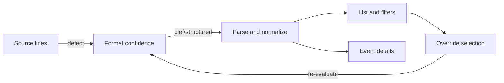

# Sprint 15: Serilog Compact Log Event Viewing

## 1. Goal

Deliver first-class viewing for Serilog Compact Log Event Format (CLEF) data so developers can work in a structured
event view by default while preserving raw-event fidelity and backward compatibility with plain-text and generic JSON
logs.

## 2. Background

- Sprint 12 introduced structured-data foundations, canonical aliases, and details inspection that can be extended for
  CLEF-specific behavior.
- Current behavior can parse JSON logs, but CLEF-specific reified semantics (`@t`, `@mt`, `@m`, `@l`, `@x`, `@i`, `@r`,
  `@tr`, `@sp`) are not explicitly first-class in list, filter, and dashboard workflows.
- Serilog compact logs are newline-delimited JSON events and should be treated as event streams rather than arbitrary
  JSON blobs.
- The roadmap requires insertion of this sprint immediately after Sprint 14, with downstream renumbering handled
  separately in roadmap consistency work.

## 3. CLEF Format Summary

### 3.1. Source References

- CLEF specification and tools/resources: `https://clef-json.org/`
- Seq raw event ingestion and compact payload details: `https://datalust.co/docs/posting-raw-events`

### 3.2. Core Semantics

- Each CLEF event is one JSON object per line.
- Stream semantics require newline-delimited JSON documents (`\n` or `\r\n`).
- Reified fields include:
    - `@t` timestamp (ISO-8601)
    - `@m` rendered message
    - `@mt` message template
    - `@l` level
    - `@x` exception text
    - `@i` event id
    - `@r` renderings array
    - `@tr` trace id
    - `@sp` span id
- User/application properties may appear as arbitrary top-level fields and must be preserved.
- MIME type convention is `application/vnd.serilog.clef`.

## 4. Gap Analysis Against Existing CLEF Tools

| Tool                               | Relevant CLEF Capabilities                                                                                       | Current KLogViewer Capability                                                                        | Gap                                                                                                                                 | Sprint Decision                                                                 |
|------------------------------------|------------------------------------------------------------------------------------------------------------------|------------------------------------------------------------------------------------------------------|-------------------------------------------------------------------------------------------------------------------------------------|---------------------------------------------------------------------------------|
| `clef-tool` (deprecated)           | CLI pretty-print, filtering expressions, template-based output, enrichment, export pipelines                     | Partial: structured display and filtering exist in app, no equivalent CLI transformation/export flow | No CLI parity for transformation pipelines; no template-driven export formatting                                                    | Deferred; explicit non-goal for Sprint 14 parity                                |
| Compact Log Format Viewer          | Dedicated CLEF viewer UX, query workflows, Serilog-focused viewing                                               | Partial: structured list/details exist, but CLEF reified fields are not fully first-class            | Needs explicit CLEF field handling in list/details/filter/search                                                                    | Must-have                                                                       |
| Seq                                | CLEF ingestion, search/filter, dashboards/charts, trace/span correlation                                         | Partial: local viewer, filtering and dashboard frequency exist                                       | Missing explicit CLEF detection confidence, trace/span-focused filtering/grouping, event-id centric views                           | Must-have for local-view parity subset; server-side ingestion/query is non-goal |
| LogViewPlus                        | Auto parser behavior, chained filters, live tail, SQL-like analysis/dashboarding                                 | Partial: detection heuristics, filters, dashboards, live tail foundations exist                      | Needs clearer property-path filtering UX and high-cardinality guardrails for CLEF-centric grouping                                  | Must-have (core), should-have (advanced grouping polish)                        |
| Clef Inspect                       | Dynamic columns from event properties, timestamp navigation, pin/hide workflows, copy as JSON/text, file tailing | Partial: details and copy flows exist; basic structured rendering available                          | Needs stronger property-centric list columns, focused copy targets (rendered/template/raw/property path), and mixed-file robustness | Must-have                                                                       |
| `seqcli`                           | Search, tail, print, ingest from JSON/CLEF, CLI-oriented workflows                                               | Partial: app is GUI only with no CLI ingestion/query path                                            | CLI workflows are outside desktop-viewing sprint scope                                                                              | Explicit non-goal                                                               |
| Analogy CLEF parser                | Dedicated CLEF parser plugin in viewer ecosystem                                                                 | Partial: generic structured parser infrastructure exists                                             | Need explicit CLEF parser path on top of existing structured pipeline                                                               | Must-have                                                                       |
| Serilog compact writer/reader libs | Ecosystem interoperability and round-trip expectations                                                           | Partial: compatibility fixtures exist from Sprint 12D                                                | Expand fixture coverage for CLEF-specific reified field combinations and malformed/mixed streams                                    | Must-have                                                                       |

### 4.1. Narrative Classification

#### Must-have for this sprint

- Hybrid detection and override controls for Serilog compact JSON interpretation.
- First-class list/details/filtering/dashboard support for `@t`, `@m`, `@mt`, `@l`, `@x`, `@i`, `@tr`, `@sp` plus user
  properties.
- Fixture-driven handling for malformed lines, mixed plain/CLEF files, and live-tail append behavior.
- Strong copy/export actions for raw event, rendered message, template, exception, and selected property path/value.

#### Should-have if low risk

- Template-rendering fallback improvements when `@m` is absent and `@mt` is present.
- Improved discoverability for grouping options and safer defaults for high-cardinality fields.

#### Deferred

- Rich SQL-like reporting parity and advanced workflow ergonomics comparable to full-featured commercial tools.
- Broad CLI transform/export workflow parity with legacy and modern command-line tools.

#### Explicit non-goals

- Becoming a Seq replacement (ingestion service, server-side query engine, alerts, app ecosystem).
- Implementing every `clef-tool`/`seqcli` command.
- Implementing full Serilog query/template language parity in Sprint 15.
- Enabling pretty-printed multi-line JSON streams as default CLEF interpretation.

## 5. Scope

- Add explicit CLEF-aware detection, parsing, normalization, and presentation behavior in the structured event view.
- Preserve raw event JSON and expose normalized/canonical fields for list rendering, filter/search, dashboarding, and
  details inspector.
- Add user control to override detected format interpretation per source/tab, persisted across sessions.
- Expand tests and fixtures to include CLEF-specific and mixed/malformed scenarios.

## 6. Out of Scope

- Server-side log ingestion APIs and distributed query execution.
- Full command-line processing pipeline parity with `clef-tool`/`seqcli`.
- Broad tracing visualization features beyond exposing/filtering/grouping by trace/span identifiers.
- Non-roadmap product behavior changes unrelated to structured event viewing.

## 7. User Stories

- As a developer, I can open Serilog compact JSON and immediately read timestamp, level, and rendered message in a
  structured log view.
- As a developer, I can inspect both raw JSON and normalized fields in event details view.
- As a developer, I can filter by level, event id, trace/span, and user properties without losing plain-text
  compatibility.
- As a support engineer, I can copy rendered message, exception, raw event, or selected property path/value for incident
  sharing.
- As an operator, I can override mis-detected format interpretation and persist my choice for this source.

## 8. UX Approach

### 8.1. Terminology Guardrails

- Avoid user-facing phrase `CLEF mode`.
- Preferred copy:
    - `Detected: Serilog compact JSON`
    - `View as structured events`
    - `Use structured event layout`
    - `Event details view`
    - `Structured log view`

### 8.2. List and Details UX

- List prioritizes `@t`, mapped level from `@l`, rendered message (`@m`), and fallback to template when needed.
- Details view presents side-by-side raw event JSON and normalized canonical view.
- Event ids and trace/span metadata are prominently visible and copyable.

## 9. Detection and Override Strategy

### 9.1. Decision

- **Hybrid strategy (recommended): autodetect + user override + persistence.**

### 9.2. Rationale

- Existing detection confidence architecture supports robust auto-classification.
- A manual override mitigates false positives/negatives for heterogeneous logs.
- Persisted per-source choice prevents repetitive manual correction.

### 9.3. Detection Signals

- Sample lines parse as JSON objects.
- Multiple CLEF reified fields appear consistently across sample.
- `@t` parses as timestamp and `@l` maps to known Serilog levels where present.
- Confidence tiers:
    - Strong CLEF
    - Probable CLEF
    - Generic JSON

## 10. Architecture and Design Notes

### 10.1. Module Anchors

- `:core` detection/parsing scaffolding:
    - `HeuristicProbe.kt`
    - `JsonConfidenceScorer.kt`
    - `CanonicalFieldAliases.kt`
    - `CanonicalFieldExtractor.kt`
- `:domain` structured model:
    - `StructuredLogData.kt`
    - `LogEntry.kt`
- `:ui` list/details/viewmodel state:
    - `LogList.kt`
    - `LogEntryDetails.kt`
    - `EntryIntentHandler.kt`

### 10.2. Flow

## 11. Data Model and Normalization Plan

- Preserve original raw line and parsed JSON object.
- Extend canonical projection to include explicit CLEF aliases:
    - `timestamp` <- `@t`
    - `message.rendered` <- `@m`
    - `message.template` <- `@mt`
    - `level` <- `@l`
    - `exception` <- `@x`
    - `event.id` <- `@i`
    - `trace.id` <- `@tr`
    - `span.id` <- `@sp`
- Keep all user properties addressable through stable property paths.
- Preserve unknown reified-like fields as user properties unless explicitly standardized.

## 12. Parser and Detection Plan

- Introduce CLEF-specific confidence scoring layered on existing JSON heuristics.
- Parse as newline-delimited event stream; tolerate partial/malformed lines with recoverable errors.
- Distinguish generic JSON logs from CLEF by requiring multi-signal evidence, not single `@` properties.
- Guard against treating pretty-printed multi-line JSON documents as CLEF streams by default.

## 13. Filtering and Search Plan

- Support level filters using mapped Serilog values (`Verbose`, `Debug`, `Information`, `Warning`, `Error`, `Fatal`).
- Support search over rendered message, message template, and exception text.
- Support property-path filtering for reified and user fields.
- Add trace/span/event-id filters and missing-property semantics.
- Preserve compatibility with existing plain-text and generic JSON query behaviors.

## 14. Dashboard and Analysis Plan

- Include CLEF canonical fields in frequency/grouping analysis.
- Provide grouping presets for level, event id, trace id, span id, source context, request path, and status code where
  available.
- Preserve/extend guardrails for high-cardinality fields to avoid noisy or expensive aggregates.

## 15. Performance Plan

- Use projection caching to avoid repeated parsing of same events.
- Keep structured expansion lazy and bounded for large payloads and deep nesting.
- Add limits/guardrails for maximum property depth, wide objects, and large exception payloads.
- Maintain live-tail responsiveness under mixed event volume.

## 16. Error Handling Plan

- Handle malformed JSON lines as recoverable parse failures without aborting the stream.
- Handle mixed plain text and CLEF by routing unparsable lines through fallback rendering.
- Handle missing `@m`/`@mt`/`@l`/`@t` gracefully with deterministic fallback display.
- Map unknown levels safely and preserve source value for details view.

## 17. Testing Strategy

- Use fixture-driven tests in `:core` parser/detection plus UI/viewmodel coverage for rendering and controls.
- Extend existing structured ecosystem fixtures with CLEF-specific cases.
- Ensure coverage includes:
    - CLEF autodetection confidence
    - Generic JSON false-positive avoidance
    - Level/timestamp/rendered/template extraction
    - Exception/event-id/trace/span extraction
    - User property and nested path preservation
    - Mixed/malformed line handling
    - Large file and live-tail behavior
    - Override persistence and copy flows

## 18. Risks and Mitigations

- **Risk:** false CLEF positives on generic JSON.
    - **Mitigation:** multi-signal confidence thresholds + user override.
- **Risk:** scope creep toward server/CLI parity.
    - **Mitigation:** enforce explicit non-goals and deferred list.
- **Risk:** dashboard overload from high-cardinality fields.
    - **Mitigation:** guardrails, capped previews, and curated defaults.
- **Risk:** terminology drift in UI copy.
    - **Mitigation:** copy guardrails and review checks in acceptance criteria.

## 19. Dependencies

- Sprint 12 structured-data foundations and alias/canonical model components.
- Existing parser confidence infrastructure in `:core`.
- UI state/intent handling for details panel and filter interactions in `:ui`.
- New/updated fixtures under current parser test suites.

## 20. Definition of Done

- [ ] CLEF detection supports strong/probable/generic confidence outcomes.
- [ ] Structured event view surfaces core CLEF fields in list/details with graceful fallbacks.
- [ ] Filtering/search/dashboard include key CLEF and property-path workflows.
- [ ] User override for format interpretation is available and persisted.
- [ ] Fixture-driven tests cover required CLEF and mixed/malformed scenarios.
- [ ] User-facing wording avoids `CLEF mode` in primary labels/copy.

## 21. Acceptance Criteria

- Opening a valid CLEF stream shows `Detected: Serilog compact JSON` and renders timestamp/level/message correctly.
- Generic NDJSON without CLEF signals remains generic JSON unless user override is applied.
- Event details view shows raw JSON and canonical fields, including template/rendered/exception/event-id/trace/span.
- Filtering by level/event-id/trace/span/property-path returns expected subsets with missing-property semantics.
- Live-tail updates preserve detection behavior and do not regress responsiveness.
- Copy actions support raw event, rendered message, template, exception, and selected property path/value.

## 22. Verification Commands

- Inventory affected references before/after renumber and doc updates:
    - `rg -n "Sprint 1[4-7]|TASKS-SPRINT-1[4-7]" README.md docs`
- Check for prohibited user-facing phrase in new sprint/task artifacts:
    - `rg -n "CLEF mode" docs/sprints docs/tasks`
- Verify new Sprint 15 docs exist:
    - `ls docs/sprints/sprint-15-clef-viewing.md docs/tasks/TASKS-SPRINT-15-CLEF-VIEWING.md`

## 23. Documentation Updates

- Add this sprint document as Sprint 15.
- Add matching tasks document for Sprint 15.
- Update roadmap references and downstream numbering in related sprint/task docs and index references.
- Reflect outcomes in `docs/project_memory.md` when sprint/task completion is finalized.

## 24. Rollout and Deferred Follow-ups

### 24.1. Rollout

- Ship behind the existing structured-view pathways without disrupting plain-text defaults.
- Validate with fixture packs and representative real-world CLEF samples before release.

### 24.2. Deferred Follow-ups

- Advanced message-template rendering edge cases.
- Expanded high-cardinality analytics controls and richer chart interactions.
- Optional future CLI interoperability workflow documentation.
