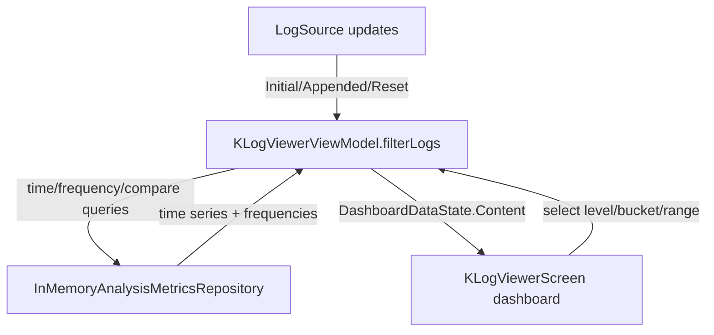

# Sprint 9: Analysis & Visualization

## 1. Goal
Transform raw log data into visual insights by providing dashboards, time-series charts, frequency analysis, and comparison tooling that remain responsive for large datasets.

## 2. Scope

### 2.1. Metrics Dashboard
- Create a dedicated "Dashboard" view.
- Implement time-series charts for log frequency (events per second/minute).
- Implement distribution charts for log levels.

### 2.2. Ad-hoc Analysis
- Enable "Frequency Analysis" on any selected field (e.g., "Show count of unique IP addresses").
- Implement log diffing to compare patterns between two time periods or two different logs.

### 2.3. Charting Engine
- Integrate a Compose-native charting library.
- Support for interactive charts (zoom, pan, click-to-filter).

### 2.4. Date-Time Controls and Comparative Analysis
- Add synchronized `From` / `To` controls and presets (`Last N minutes`, `Visible window`, `Full loaded range`, `Custom`).
- Support brush/range selection from chart interactions to update active time filters.
- Provide A/B comparison with explicit baseline/comparison windows and deterministic delta ordering.

## 3. Accepted ADRs and Key Decisions

### Accepted ADR Links
- [ADR-037: Analysis Architecture and Data Flow](../adr/adr-037-analysis-architecture-and-data-flow.md)
- [ADR-039: Sprint 9 Restart Foundations](../adr/adr-039-sprint-9-restart-foundations.md)
- [ADR-040: Charting Library Selection and Benchmark](../adr/adr-040-charting-library-selection-and-benchmark.md)

### Key Decisions
- **Sampling for Performance**: Use deterministic sampling for very large datasets to preserve responsiveness while keeping repeated analysis outcomes stable.
- **Background Aggregation**: Perform metric calculations on `Dispatchers.Default` with cancellation/debounce to avoid stale or blocking UI work.
- **Charting Strategy**: Use KoalaPlot as primary charting backend with a documented fallback path (`Vico`).

## 4. Final Architecture (Dashboard Pipeline)

## 5. Definition of Done
- [x] A dashboard view shows real-time log frequency and level distribution.
- [x] Users can generate a frequency report for any structured field.
- [x] Charts are interactive and integrated into the desktop UI theme.
- [x] Log diffing provides a clear visual comparison of two log streams.
- [x] Date-time controls synchronize dashboard, frequency analysis, and comparison workflows.
